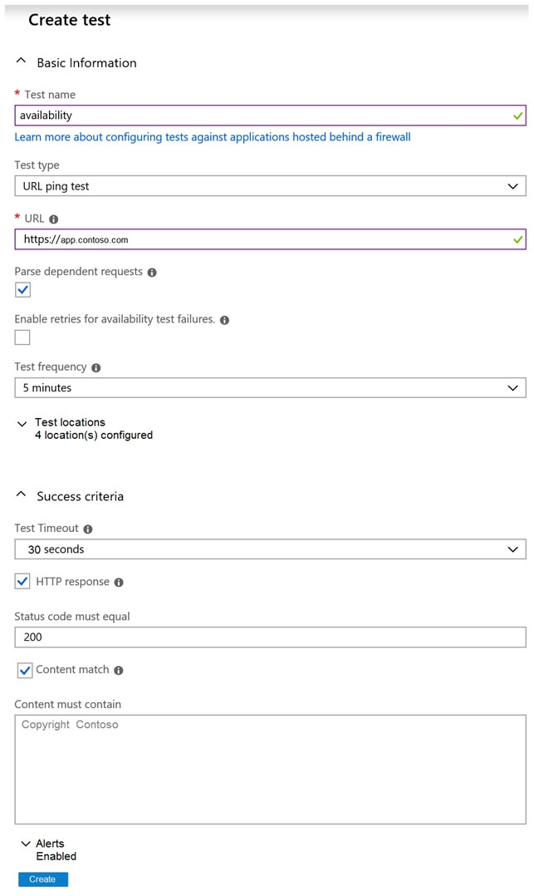

## Question 1

You have an Azure subscription that contains multiple Azure services.

You need to send an SMS alert when scheduled maintenance is planned for the Azure services.

Which two actions should you perform? Each correct answer presents part of the solution.

NOTE: Each correct selection is worth one point.

-   [ ] A. Enable Azure Security Center.
-   [ ] B. Create and configure an Azure Monitor alert rule.
-   [ ] C. Create an Azure Service Health alert.
-   [ ] D. Create and configure an action group.

    
answer

    C, D 
    <a href="https://learn.microsoft.com/en-us/azure/azure-monitor/alerts/alerts-create-new-alert-rule?tabs=resource-health#create-a-new-alert-rule-in-the-azure-portal">https://learn.microsoft.com/en-us/azure/azure-monitor/alerts/alerts-create-new-alert-rule?tabs=resource-health#create-a-new-alert-rule-in-the-azure-portal</a>

---

## Question 2

You have an Azure DevOps organization named Contoso and an Azure subscription. The subscription contains an Azure virtual machine scale set named VMSS1 that is configured for autoscaling.

You have a project in Azure DevOps named Project1. Project1 is used to build a web app named App1 and deploy App1 to VMSS1.

You need to ensure that an email alert is generated whenever VMSS1 scales in or out.

Solution: From Azure Monitor, configure the autoscale settings.

Does this meet the goal?

-   [ ] A. Yes
-   [ ] B. No

    
answer

    B 
    <a href="https://learn.microsoft.com/en-us/azure/azure-monitor/alerts/action-groups">https://learn.microsoft.com/en-us/azure/azure-monitor/alerts/action-groups</a>

---

## Question 3

You configure Azure Application Insights and the shared service plan tier for a web app.

You enable Smart Detection.

You confirm that standard metrics are visible in the logs, but when you test a failure, you do not receive a Smart Detection notification.

What prevents the Smart Detection notification from being sent?

-   [ ] A. You must enable the Snapshot Debugger for the web app.
-   [ ] B. Smart Detection uses the first 24 hours to establish the normal behavior of the web app.
-   [ ] C. The web app is configured to use the shared service plan tier.
-   [ ] D. You must restart the web app before Smart Detection is enabled.

    
answer

    B 
    <a href="https://learn.microsoft.com/en-us/azure/azure-monitor/alerts/proactive-failure-diagnostics">https://learn.microsoft.com/en-us/azure/azure-monitor/alerts/proactive-failure-diagnostics</a>

---

## Question 4

You are planning projects for three customers. Each customer's preferred process for work items is shown in the following table.

| Customer name       | Preferred process                                                                                                |
| ------------------- | ---------------------------------------------------------------------------------------------------------------- |
| Litware, Inc        | Track product backlog items(PBIs) and bugs on the Kanban board.Break the PBIs down into tasks on the task board. |
| Contoso, Ltd        | Track user stories and bugs on the Kanban board. Track the bugs and tasks on the task board.                     |
| A.Datum Corporation | Track requirements, change requests, risks and reviews                                                           |

The customers all plan to use Azure DevOps for work item management.

Which work item process should you use for each customer?

**Litware:**

-   [ ] Agile
-   [ ] CMMI
-   [ ] Scrum
-   [ ] XP

**Contoso:**

-   [ ] Agile
-   [ ] CMMI
-   [ ] Scrum
-   [ ] XP

**A.Datum:**

-   [ ] Agile
-   [ ] CMMI
-   [ ] Scrum
-   [ ] XP

    
answer

    Litware:Scrum 
    Contoso:Agile 
    A.Datum:CMMI 
    <a href="https://learn.microsoft.com/en-us/azure/devops/boards/work-items/guidance/choose-process?view=azure-devops&tabs=agile-process">https://learn.microsoft.com/en-us/azure/devops/boards/work-items/guidance/choose-process?view=azure-devops&tabs=agile-process</a>

---

## Question 5

You configure an Azure Application Insights availability test.

You need to notify the customer services department at your company by email when availability is degraded.

You create an Azure logic app that will handle the email and follow up actions.

Which type of trigger should you use to invoke the logic app?

-   [ ] A. an HTTPWebhook trigger
-   [ ] B. an HTTP trigger
-   [ ] C. a Request trigger
-   [ ] D. an ApiConnection trigger

    
answer

    B 
    <a href="https://learn.microsoft.com/en-us/azure/azure-monitor/alerts/alerts-webhooks">https://learn.microsoft.com/en-us/azure/azure-monitor/alerts/alerts-webhooks</a>

---

## Question 6

You have an Azure DevOps organization named Contoso and an Azure subscription.

You use Azure DevOps to build a containerized app named App1 and deploy App1 to an Azure container instance named ACI1.

You need to restart ACI1 when App1 stops responding.

What should you do?

-   [ ] A. Add a liveness probe to the YAML configuration of App1.
-   [ ] B. Add a readiness probe to the YAML configuration of App1.
-   [ ] C. Use Connection Monitor in Azure Network Watcher.
-   [ ] D. Use IP flow verify in Azure Network Watcher.

    
answer

    A 
    <a href="https://learn.microsoft.com/en-us/azure/container-instances/container-instances-liveness-probe">https://learn.microsoft.com/en-us/azure/container-instances/container-instances-liveness-probe</a>

---

## Question 7

You have a multi-tier application that has an Azure Web Apps front end and an Azure SQL Database back end.

You need to recommend a solution to capture and store telemetry data. The solution must meet the following requirements:

✑ Support using ad-hoc queries to identify baselines.

✑ Trigger alerts when metrics in the baseline are exceeded.

✑ Store application and database metrics in a central location.

What should you include in the recommendation?

-   [ ] A. Azure Event Hubs
-   [ ] B. Azure SQL Database Intelligent Insights
-   [ ] C. Azure Application Insights
-   [ ] D. Azure Log Analytics

    
answer

    D 
    <a href="https://learn.microsoft.com/en-us/azure/azure-monitor/essentials/resource-logs#send-to-log-analytics-workspace">https://learn.microsoft.com/en-us/azure/azure-monitor/essentials/resource-logs#send-to-log-analytics-workspace</a>

---

## Question 8

You have an Azure DevOps organization named Contoso and an Azure subscription. The subscription contains an Azure virtual machine scale set named VMSS1 that is configured for autoscaling.

You use Azure DevOps to build a web app named App1 and deploy App1 to VMSS1. App1 is used heavily and has usage patterns that vary on a weekly basis.

You need to recommend a solution to detect an abnormal rise in the rate of failed requests to App1. The solution must minimize administrative effort.

What should you include in the recommendation?

-   [ ] A. the Smart Detection feature in Azure Application Insights
-   [ ] B. the Failures feature in Azure Application Insights
-   [ ] C. an Azure Service Health alert
-   [ ] D. an Azure Monitor alert that uses an Azure Log Analytics query

    
answer

    A 
    <a href="https://learn.microsoft.com/en-us/azure/azure-monitor/alerts/proactive-failure-diagnostics">https://learn.microsoft.com/en-us/azure/azure-monitor/alerts/proactive-failure-diagnostics</a>

---

## Question 10

You have an Azure subscription that contains resources in several resource groups.

You need to design a monitoring strategy that will provide a consolidated view. The solution must support the following requirements:

✑ Support role-based access control (RBAC) by using Azure Active Directory (Azure AD) identifies.

✑ Include visuals from Azure Monitor that are generated by using the Kusto query language.

✑ Support documentation written in markdown.

✑ Use the latest data available for each visual.

What should you use to create the consolidated view?

-   [ ] A. Azure Monitor
-   [ ] B. Microsoft Power BI
-   [ ] C. Azure Data Explorer
-   [ ] D. Azure dashboards

    
answer

    C 
    <a href="https://learn.microsoft.com/en-us/azure/databricks/data/markdown-data-comments">markdown</a> 
    <a href="https://learn.microsoft.com/en-us/azure/data-explorer/tools-integrations-overview">https://learn.microsoft.com/en-us/azure/data-explorer/tools-integrations-overview</a>

---

## Question 11

You are automating the testing process for your company.

You need to automate UI testing of a web application.

Which framework should you use?

-   [ ] A. JaCoco
-   [ ] B. Selenium
-   [ ] C. Xamarin.UITest
-   [ ] D. Microsoft.CodeAnalysis

    
answer

    B 
    <a href="https://learn.microsoft.com/en-us/azure/devops/pipelines/test/continuous-test-selenium?view=azure-devops">https://learn.microsoft.com/en-us/azure/devops/pipelines/test/continuous-test-selenium?view=azure-devops</a>

---

## Question 12

You are building an ASP.NET Core application.

You plan to create an application utilization baseline by capturing telemetry data.

You need to add code to the application to capture the telemetry data. The solution must minimize the costs of storing the telemetry data.

Which two actions should you perform? Each correct answer presents part of the solution.

NOTE: Each correct selection is worth one point

-   [ ] A. Add the \<InitialSamplingPercentage>99\</InitialSamplingPercentage> parameter to the ApplicationInsights.config file.
-   [ ] B. From the code of the application, enable adaptive sampling.
-   [ ] C. From the code of the application, add Azure Application Insights telemetry.
-   [ ] D. Add the \<MaxTelemetryItemsPerSecond>5\</MaxTelemetryItemsPerSecond> parameter to the ApplicationInsights.config file.
-   [ ] E. From the code of the application, disable adaptive sampling.

    
answer

    B,D 
    <a href="https://learn.microsoft.com/en-us/azure/azure-monitor/app/sampling?tabs=net-core-new">https://learn.microsoft.com/en-us/azure/azure-monitor/app/sampling?tabs=net-core-new</a>

---

## Question 13

You have an Azure DevOps organization named Contoso and an Azure subscription. The subscription contains an Azure virtual machine scale set named VMSS1 and an Azure Standard Load Balancer named LB1. LB1 distributes incoming requests across VMSS1 instances.

You use Azure DevOps to build a web app named App1 and deploy App1 to VMSS1. App1 is accessible via HTTPS only and configured to require mutual authentication by using a client certificate.

You need to recommend a solution for implementing a health check of App1. The solution must meet the following requirements:

✑ Identify whether individual instances of VMSS1 are eligible for an upgrade operation.

✑ Minimize administrative effort.

What should you include in the recommendation?

-   [ ] A. an Azure Load Balancer health probe
-   [ ] B. Azure Monitor autoscale
-   [ ] C. the Custom Script Extension
-   [ ] D. the Application Health extension

    
answer

    D 
    <a href="https://learn.microsoft.com/en-us/azure/virtual-machine-scale-sets/virtual-machine-scale-sets-health-extension?tabs=rest-api#when-to-use-the-application-health-extension">When to use the Application Health extension</a>

---

## Question 14

You have an application named App1 that has a custom domain of app.contoso.com.

**The test will execute [ ]**

-   [ ] A. every 30 seconds at random location
-   [ ] B. every 30 seconds per location
-   [ ] C. every five minutes at a random location
-   [ ] D. every five minutes per location

**The test will pass if [ ] within 30 seconds**

-   [ ] A. App1 responds to an ICMP ping
-   [ ] B. the HTML of App1 and the HTML from URLs in \<a> tags load
-   [ ] C. all the HTML, JavaScripts, and images of App1 load

    
answer

    The test will execute [C] 
    The test will pass if [C] within 30 seconds 
    <a href="https://learn.microsoft.com/en-us/previous-versions/azure/azure-monitor/app/monitor-web-app-availability">https://learn.microsoft.com/en-us/previous-versions/azure/azure-monitor/app/monitor-web-app-availability</a>

---

## Question 15

You have a build pipeline in Azure Pipelines that occasionally fails.

You discover that a test measuring the response time of an API endpoint causes the failures.

You need to prevent the build pipeline from failing due to the test.

Which two actions should you perform? Each correct answer presents part of the solution.

NOTE: Each correct selection is worth one point.

-   [ ] A. Set Flaky test detection to Off.
-   [ ] B. Clear Flaky tests included in test pass percentage.
-   [ ] C. Enable Test Impact Analysis (TIA).
-   [ ] D. Manually mark the test as Flaky.
-   [ ] E. Enable test slicing.

    
answer

    B, D 
    <a href="https://learn.microsoft.com/en-us/azure/devops/pipelines/test/flaky-test-management?view=azure-devops">https://learn.microsoft.com/en-us/azure/devops/pipelines/test/flaky-test-management?view=azure-devops</a>

---

## Question 16

Your company hosts a web application in Azure. The company uses Azure Pipelines for the build and release management of the application.

Stakeholders report that the past few releases have negatively affected system performance.

You configure alerts in Azure Monitor.

You need to ensure that new releases are only deployed to production if the releases meet defined performance baseline criteria in the staging environment first.

What should you use to prevent the deployment of releases that fall to meet the performance baseline?

-   [ ] A. an Azure Scheduler job
-   [ ] B. a trigger
-   [ ] C. a gate
-   [ ] D. an Azure function

    
answer

    C 
    <a href="https://learn.microsoft.com/en-us/azure/devops/pipelines/release/approvals/gates?view=azure-devops">https://learn.microsoft.com/en-us/azure/devops/pipelines/release/approvals/gates?view=azure-devops</a>

---

## Question 18

Your company uses the following resources:

✑ Windows Server 2019 container images hosted in an Azure Container Registry.

✑ Azure virtual machines that run the latest version of Ubuntu

✑ An Azure Log Analytics workspace

✑ Azure Active Directory (Azure AD)

✑ An Azure key vault

For which two resources can you receive vulnerability assessments in Azure Security Center? Each correct answer presents part of the solution.

NOTE: Each correct selection is worth one point.

-   [ ] A. the Azure Log Analytics workspace
-   [ ] B. the Azure key vault
-   [ ] C. the Azure virtual machines that run the latest version of Ubuntu
-   [ ] D. Azure Active Directory (Azure AD)
-   [ ] E. The Windows Server 2019 container images hosted in the Azure Container Registry.

    
answer

    B, C 
    <a href="https://learn.microsoft.com/en-us/azure/defender-for-cloud/defender-for-key-vault-introduction">key vault</a> 
    <a href="https://learn.microsoft.com/en-us/azure/defender-for-cloud/deploy-vulnerability-assessment-vm">Server</a> 
    Defender could scan the images in the container, but did not support windows,<a href="https://learn.microsoft.com/en-us/azure/defender-for-cloud/support-matrix-defender-for-containers?tabs=azure-aks#registries-and-images">Registries and images </a>

---

## Question 19

You use Azure Pipelines to manage build pipelines, GitHub to store source code, and Dependabot to manage dependencies.

You have an app named App1.

Dependabot detects a dependency in App1 that requires an update.

What should you do first to apply the update?

-   [ ] A. Create a pull request.
-   [ ] B. Approve the pull request.
-   [ ] C. Create a branch.
-   [ ] D. Perform a commit.

    
answer

    B 
    <a href="https://samlearnsazure.blog/2019/12/20/github-using-dependabot/">GitHub: Using DependaBot</a>

---

## Question 23

You are designing a configuration management solution to support five apps hosted on Azure App Service. Each app is available in the following

three environments: development, test, and production.

You need to recommend a configuration management solution that meets the following requirements:

✑ Supports feature flags

✑ Tracks configuration changes from the past 30 days

✑ Stores hierarchically structured configuration values

✑ Controls access to the configurations by using role-based access control (RBAC) permissions

✑ Stores shared values as key/value pairs that can be used by all the apps

Which Azure service should you recommend as the configuration management solution?

-   [ ] A. Azure Cosmos DB
-   [ ] B. Azure App Service
-   [ ] C. Azure App Configuration
-   [ ] D. Azure Key Vault

    
answer

    C 
    <a href="https://learn.microsoft.com/en-us/azure/azure-app-configuration/overview">What is Azure App Configuration?</a>

---

## Question 24

You have a containerized solution that runs in Azure Container Instances. The solution contains a frontend container named App1 and a backend container named DB1. DB1 loads a large amount of data during startup.

You need to verify that DB1 can handle incoming requests before users can submit requests to App1.

What should you configure?

-   [ ] A. a liveness probe
-   [ ] B. a performance log
-   [ ] C. a readiness probe
-   [ ] D. an Azure Load Balancer health probe

    
answer

    C 
    <a href="https://learn.microsoft.com/en-us/azure/container-instances/container-instances-readiness-probe">Configure readiness probes</a> 
    <a href="https://learn.microsoft.com/en-us/azure/container-instances/container-instances-liveness-probe">Configure liveness  probes</a>

---

## Question 26

You use Azure Pipelines to automate Continuous Integration/Continuous Deployment (CI/CD) for an Azure web app named WebApp1.

You configure an Azure Monitor alert that is triggered when WebApp1 generates an error.

You need to configure the alert to forward details of the error to a third-party system. The solution must minimize administrative effort.

Which three actions should you perform in sequence?

-   [ ] A. Select the recurrence trigger
-   [ ] B. create an Azure event hub
-   [ ] C. Create an Azure logic app
-   [ ] D. Select the HTTP request trigger
-   [ ] E. Update the action group in Azure Monitor
-   [ ] F. Select the Sliding Window trigger

    
answer

    C. Create an Azure logic app 
    D. Select the HTTP request trigger 
    E. Update the action group in Azure Monitor 
    <a href="https://learn.microsoft.com/en-us/azure/azure-monitor/alerts/alerts-logic-apps?tabs=send-email">Customize alert notifications by using Logic Apps</a>

---

## Question 27

You have an Azure DevOps organization named Contoso and an Azure subscription. The subscription contains an Azure virtual machine scale set named VMSS1 that is configured for autoscaling.

You have a project in Azure DevOps named Project1. Project1 is used to build a web app named App1 and deploy App1 to VMSS1.

You need to ensure that an email alert is generated whenever VMSS1 scales in or out.

Solution: From Azure DevOps, configure the Notifications settings for Project1.

Does this meet the goal?

-   [ ] A. Yes
-   [ ] B. No

    
answer

    B 
    <a href="https://learn.microsoft.com/en-us/azure/devops/organizations/notifications/about-notifications?view=azure-devops">About notifications</a>

---

## Question 28

You have an Azure DevOps organization named Contoso and an Azure subscription. The subscription contains an Azure virtual machine scale set named VMSS1 that is configured for autoscaling.

You have a project in Azure DevOps named Project1. Project1 is used to build a web app named App1 and deploy App1 to VMSS1.

You need to ensure that an email alert is generated whenever VMSS1 scales in or out.

Solution: From Azure DevOps, configure the Service hooks settings for Project1.

Does this meet the goal?

-   [ ] A. Yes
-   [ ] B. No

    
answer

    B 
    <a href="https://learn.microsoft.com/en-us/azure/devops/service-hooks/overview?toc=%2Fazure%2Fdevops%2Forganizations%2Ftoc.json&view=azure-devops">Integrate with service hooks</a>

---

## Question 29

You have an Azure DevOps organization named Contoso and an Azure subscription. The subscription contains an Azure virtual machine scale set named VMSS1 that is configured for autoscaling.

You have a project in Azure DevOps named Project1. Project1 is used to build a web app named App1 and deploy App1 to VMSS1.

You need to ensure that an email alert is generated whenever VMSS1 scales in or out.

Solution: From Azure Monitor, create an action group.

Does this meet the goal?

-   [ ] A. Yes
-   [ ] B. No

    
answer

    A 
    <a href="https://learn.microsoft.com/en-us/azure/azure-monitor/alerts/action-groups">Create and manage action groups in the Azure portal</a>

---

## Question 30

You are using the Dependency Tracker extension in a project in Azure DevOps.

You generate a risk graph for the project.

What should you use in the risk graph to identify the number of dependencies and the risk level of the project?

**Number of dependencies**

-   [ ] A. Link color
-   [ ] B. Link length
-   [ ] C. Link width
-   [ ] D. Node color

**Risk level**

-   [ ] A. Link color
-   [ ] B. Link length
-   [ ] C. Link width
-   [ ] D. Node color

    
answer

    Number of dependencies: C 
    Risk level: D 
    <a href="https://learn.microsoft.com/en-us/azure/devops/boards/extensions/dependency-tracker?view=azure-devops#risk-graph">Risk Graph</a>

---
