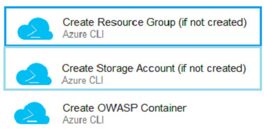

## Question 2

You have a project in Azure DevOps.

You create the following YAML template named Template1.yml.

```yaml
steps:
    - script: npm install
    - script: yarn install
    - script: npm run compile
```

You create the following pipeline named File1.yml.

```yaml
parameters:
    usersteps:
        - task: MyTask@1
        - script: echo Done
```

You need to ensure that Template1.yaml runs before File1.yml.

How should you update File1.yml?

-   [ ] A.

```yaml
parameters:
    usersteps:
    extends:
        template: template1.yml
        - task: MyTask@1
        - script: echo Done
```

-   [ ] B.

```yaml
template: template1.yml
parameters:
    usersteps:
        - task: MyTask@1
        - script: echo Done
```

-   [ ] C.

```yaml
extends:
    template: template1.yml
    parameters:
        usersteps:
            - task: MyTask@1
            - script: echo Done
```

-   [ ] D.

```yaml
parameters:
    usersteps:
        - template: template1.yml
        - task: MyTask@1
        - script: echo Done
```

<details>
    <summary>answer</summary>
    C. <br/>
    <a href ="https://learn.microsoft.com/en-us/azure/devops/pipelines/security/templates?view=azure-devops#use-extends-templates">Use extends templates</a>
</details>

---

## Question 3

You have an Azure solution that contains a build pipeline in Azure Pipelines.

You experience intermittent delays before the build pipeline starts.

You need to reduce the time it takes to start the build pipeline.

What should you do?

-   [ ] A. Enable self-hosted build agents.
-   [ ] B. Create a new agent pool.
-   [ ] C. Split the build pipeline into multiple stages.
-   [ ] D. Purchase an additional parallel job.

<details>
    <summary>answer</summary>
    D. Purchase an additional parallel job. <br/>
    <a href ="https://learn.microsoft.com/en-us/azure/devops/pipelines/troubleshooting/troubleshooting?view=azure-devops">Troubleshoot pipeline runs</a>
</details>

---

## Question 5

You store source code in a Git repository in Azure Repos. You use a third-party continuous integration (CI) tool to control builds.

What will Azure DevOps use to authenticate with the tool?

-   [ ] A. certificate authentication
-   [ ] B. a personal access token (PAT)
-   [ ] C. a Shared Access Signature (SAS) token
-   [ ] D. NTLM authentication

<details>
    <summary>answer</summary>
    B. a personal access token (PAT)<br/>
</details>

---

## Question 11

Your company uses a Git repository in Azure Repos to manage the source code of a web application. The master branch is protected from direct updates.

Developers work on new features in the topic branches.

Because of the high volume of requested features, it is difficult to follow the history of the changes to the master branch.

You need to enforce a pull request merge strategy. The strategy must meet the following requirements:

✑ Consolidate commit histories.
✑ Merge the changes into a single commit.

Which merge strategy should you use in the branch policy?

-   [ ] A. squash merge
-   [ ] B. fast-forward merge
-   [ ] C. Git fetch
-   [ ] D. no-fast-forward merge

<details>
    <summary>answer</summary>
    A. squash merge<br/>
</details>

---

## Question 14

You are automating the build process for a Java-based application by using Azure DevOps.

You need to add code coverage testing and publish the outcomes to the pipeline.

What should you use?

-  [ ] A. Bullseye Coverage
-  [ ] B. JUnit
-  [ ] C. JaCoCo
-  [ ] D. MSTest

<details>
    <summary>answer</summary>
    C. JaCoCo<br/>
    <a href="https://learn.microsoft.com/en-us/azure/devops/pipelines/tasks/reference/publish-code-coverage-results-v1?view=azure-pipelines&viewFallbackFrom=azure-devops"> coverage results v1 task</a>
</details>

---

## Question 17

You are automating the build process for a Java-based application by using Azure DevOps.

You need to add code coverage testing and publish the outcomes to the pipeline.

What should you use?

-  [ ] A. Cobertura
-  [ ] B. Bullseye Coverage
-  [ ] C. MSTest
-  [ ] D. Coverlet

<details>
    <summary>answer</summary>
    A. Cobertura<br/>
    <a href="https://learn.microsoft.com/en-us/azure/devops/pipelines/tasks/reference/publish-code-coverage-results-v1?view=azure-pipelines&viewFallbackFrom=azure-devops"> coverage results v1 task</a>
</details>

---

## Question 18

You have an existing build pipeline in Azure Pipelines.

You need to use incremental builds without purging the environment between pipeline executions.

What should you use?

-  [ ] A. a self-hosted agent
-  [ ] B. Microsoft-hosted parallel jobs
-  [ ] C. a File Transform task

<details>
    <summary>answer</summary>
    A. a self-hosted agent<br/>
</details>

---

## Question 19

You are designing YAML-based Azure pipelines for the apps shown in the following table.

| name | Platform                         | Release requirements                                                                                                                                |
| ---- | -------------------------------- | --------------------------------------------------------------------------------------------------------------------------------------------------- |
| App1 | Azure virtual machine            | replace a fixed set of existing instances of the previous version of App1 with instances of the new version of the app in each iteration            |
| App2 | Azure kubernetes Service cluster | Roll out a limited deployment of the new version of App2 to validate the functionality of the app . once testing is successful , expand the rollout |

You need to configure the YAML strategy value for each app. The solution must minimize app downtime.
Which value should you configure for each app? To

**App1**

-   [ ] A. canary
-   [ ] B. rolling
-   [ ] C. runonce

**App2**

-   [ ] A. canary
-   [ ] B. rolling
-   [ ] C. runonce

<details>
    <summary>answer</summary>
    App1 : B. rolling<br/>
    App2 : A. canary<br/>
</details>

---

## Question 20

You have a private project in Azure DevOps.

You need to ensure that a project manager can create custom work item queries to report on the project's progress. The solution must use the principle of least privilege.

To which security group should you add the project manager?

-   [ ] A. Reader
-   [ ] B. Project Collection Administrators
-   [ ] C. Project Administrators
-   [ ] D. Contributor

<details>
    <summary>answer</summary>
    D. Contributor<br/>
    <a href="https://learn.microsoft.com/en-us/azure/devops/organizations/security/permissions?view=azure-devops&tabs=preview-page">Security groups, service accounts, and permissions in Azure DevOps</a>
</details>

---

## Question 21

Your company has a project in Azure DevOps for a new application. The application will be deployed to several Azure virtual machines that run Windows Server 2019.

You need to recommend a deployment strategy for the virtual machines. The strategy must meet the following requirements:

✑ Ensure that the virtual machines maintain a consistent configuration.
✑ Minimize administrative effort to configure the virtual machines.

What should you include in the recommendation?

-   [ ] A. Azure Resource Manager templates and the PowerShell Desired State Configuration (DSC) extension for Windows
-   [ ] B. Deployment YAML and Azure pipeline deployment groups
-   [ ] C. Azure Resource Manager templates and the Custom Script Extension for Windows
-   [ ] D. Deployment YAML and Azure pipeline stage templates

<details>
    <summary>answer</summary>
    C. Azure Resource Manager templates and the Custom Script Extension for Windows<br/>
    <a href="https://learn.microsoft.com/en-us/azure/virtual-machines/extensions/custom-script-windows">Custom Script Extension for Windows</a>
</details>

---

## Question 22

You have an Azure DevOps project that uses many package feeds.

You need to simplify the project by using a single feed that stores packages produced by your company and packages consumed from remote feeds. The solution must support public feeds and authenticated feeds.

What should you enable in DevOps?

-   [ ] A. Universal Packages
-   [ ] B. upstream sources
-   [ ] C. views in Azure Artifacts
-   [ ] D. a symbol server

<details>
    <summary>answer</summary>
    B. upstream sources<br/>
</details>

---

## Question 25

You are creating a container for an ASP.NET Core app.

You need to create a Dockerfile file to build the image. The solution must ensure that the size of the image is minimized.

How should you configure the file?

```docker
FROM AAAA AS build-env
COPY . /app/
WORKDIR /app
RUN BBBB
FROM CCCC
COPY --from=build-env /app/out /app
WORKDIR /app
ENTRYPOINT ["dotnet", "MvcMovie.dll"]
```

**AAAA**

-   [ ] A. `dotnet public -c Release -o out`
-   [ ] B. `dotnet restore`
-   [ ] C. `mcr.microsoft.com/dotnet/aspnet:5.0`
-   [ ] D. `mcr.microsoft.com/dotnet/sdk:5.0`

**BBBB**

-   [ ] A. `dotnet public -c Release -o out`
-   [ ] B. `dotnet restore`
-   [ ] C. `mcr.microsoft.com/dotnet/aspnet:5.0`
-   [ ] D. `mcr.microsoft.com/dotnet/sdk:5.0`

**CCCC**

-   [ ] A. `dotnet public -c Release -o out`
-   [ ] B. `dotnet restore`
-   [ ] C. `mcr.microsoft.com/dotnet/aspnet:5.0`
-   [ ] D. `mcr.microsoft.com/dotnet/sdk:5.0`

<details>
    <summary>answer</summary>
    AAAA : D. `mcr.microsoft.com/dotnet/sdk:5.0`<br/>
    BBBB : B. `dotnet restore`<br/>
    CCCC : C. `mcr.microsoft.com/dotnet/aspnet:5.0`<br/>
    <a href = "https://learn.microsoft.com/en-us/virtualization/windowscontainers/quick-start/building-sample-app"> Containerize a .NET Core App </a>
</details>

---

## Question 27

You use a Git repository in Azure Repos to manage the source code of a web application. Developers commit changes directly to the default branch.

You need to implement a change management procedure that meets the following requirements:

✑ The default branch must be protected, and new changes must be built in the feature branches first.

✑ Changes must be reviewed and approved by at least one release manager before each merge.

✑ Changes must be brought into the default branch by using pull requests.

What should you configure in Azure Repos?

-   [ ] A. branch policies of the default branch
-   [ ] B. Services in Project Settings
-   [ ] C. Deployment pools in Project Settings
-   [ ] D. branch security of the default branch

<details>
    <summary>answer</summary>
     A. branch policies of the default branch<br/>
</details>

---

## Question 28

Your company uses Azure DevOps to manage the build and release processes for applications.

You use a Git repository for applications source control.

You need to implement a pull request strategy that reduces the history volume in the master branch.

Solution: You implement a pull request strategy that uses fast-forward merges.

Does this meet the goal?

-   [ ] A. Yes
-   [ ] B. No

<details>
    <summary>answer</summary>
     B. No<br/>
</details>

---

## Question 29

Your company uses Azure DevOps to manage the build and release processes for applications.

You use a Git repository for applications source control.

You need to implement a pull request strategy that reduces the history volume in the master branch.

Solution: You implement a pull request strategy that uses squash merges.

Does this meet the goal?

-   [ ] A. Yes
-   [ ] B. No

<details>
    <summary>answer</summary>
     A. Yes<br/>
</details>

---

## Question 32

You need to recommend a Docker container build strategy that meets the following requirements:

✑ Minimizes image sizes

✑ Minimizes the security surface area of the final image

What should you include in the recommendation?

-   [ ] A. multi-stage builds
-   [ ] B. PowerShell Desired State Configuration (DSC)
-   [ ] C. Docker Swarm
-   [ ] D. single-stage builds

<details>
    <summary>answer</summary>
    A. multi-stage builds<br/>
    <a href="https://docs.docker.com/build/building/multi-stage/">Multi-stage builds</a>
</details>

---

## Question 34

Your company has a project in Azure DevOps for a new web application.

You need to ensure that when code is checked in, a build runs automatically.

Solution: From the Triggers tab of the build pipeline, you select Batch changes while a build is in progress.

Does this meet the goal?

-   [ ] A. Yes
-   [ ] B. No

<details>
    <summary>answer</summary>
    B. No<br/>
</details>

---

## Question 35

You need to deploy Azure Kubernetes Service (AKS) to host an application. The solution must meet the following requirements:

✑ Containers must only be published internally.

✑ AKS clusters must be able to create and manage containers in Azure.

What should you use for each requirement?

**Containers must only be published internally.**

-   [ ] A. Azure Container Instances
-   [ ] B. Azure Container Registry
-   [ ] C. Dockerfile

**AKS clusters must be able to create and manage containers in Azure.**

-   [ ] A. An Azure Active Directory group
-   [ ] B. An Azure Automation account
-   [ ] C. An Azure service principal

<details>
    <summary>answer</summary>
    Containers must only be published internally : B. Azure Container Registry<br/>
    AKS clusters must be able to create and manage containers in Azure : C. An Azure service principal<br/>
</details>

---

## Question 36

You have 50 Node.js-based projects that you scan by using WhiteSource. Each project includes Package.json, Package-lock.json, and Npm-shrinkwrap.json files.

You need to minimize the number of libraries reports by WhiteSource to only the libraries that you explicitly reference.

What should you do?

-   [ ] A. Configure the File System Agent plug-in.
-   [ ] B. Add a devDependencies section to Package-lock.json.
-   [ ] C. Configure the Artifactory plug-in.
-   [ ] D. Delete Package-lock.json

<details>
    <summary>answer</summary>
    B. Add a devDependencies section to Package-lock.json.<br/>
</details>

---

## Question 37

Your company deploys applications in Docker containers.

You want to detect known exploits in the Docker images used to provision the Docker containers.

You need to integrate image scanning into the application lifecycle. The solution must expose the exploits as early as possible during the application lifecycle.

What should you configure?

-   [ ] A. a task executed in the continuous integration pipeline and a scheduled task that analyzes the image registry
-   [ ] B. manual tasks performed during the planning phase and the deployment phase
-   [ ] C. a task executed in the continuous deployment pipeline and a scheduled task against a running production container
-   [ ] D. a task executed in the continuous integration pipeline and a scheduled task that analyzes the production container

<details>
    <summary>answer</summary>
     A. a task executed in the continuous integration pipeline and a scheduled task that analyzes the image registry<br/>
</details>

---

## Question 38

Your company has a hybrid cloud between Azure and Azure Stack.

The company uses Azure DevOps for its full CI/CD pipelines. Some applications are built by using Erlang and Hack.

You need to ensure that Erlang and Hack are supported as part of the build strategy across the hybrid cloud. The solution must minimize management overhead.

What should you use to execute the build pipeline?

-   [ ] A. a Microsoft-hosted agent
-   [ ] B. Azure DevOps self-hosted agents on Azure DevTest Labs virtual machines.
-   [ ] C. Azure DevOps self-hosted agents on Hyper-V virtual machines
-   [ ] D. Azure DevOps self-hosted agents on virtual machines that run on Azure Stack

<details>
    <summary>answer</summary>
    D. Azure DevOps self-hosted agents on virtual machines that run on Azure Stack<br/>
</details>

---

## Question 40

You have an Azure subscription that contains an Azure Active Directory (Azure AD) tenant.

You are configuring a build pipeline in Azure Pipelines that will include a task named Task1. Task1 will authenticate by using an Azure AD service principal.

Which three values should you configure for Task1?

-   [ ] A. the tenant ID
-   [ ] B. the subscription ID
-   [ ] C. the client secret
-   [ ] D. the app ID
-   [ ] E. the object ID

<details>
    <summary>answer</summary>
    A. the tenant ID<br/>
    B. the subscription ID<br/>
    C. the client secret<br/>
    
    Subscription ID<br/>
    Subscription name<br/>
    Service principal ID<br/>
    Either the service principal client key or, if you have selected Certificate, enter the contents of both the certificate and private key sections of the *.pem file.<br/>
    Tenant ID<br/>
    
    <a href = "[https://learn.microsoft.com/en-us/azure/devops/pipelines/library/connect-to-azure?view=azure-devops#create-an-azure-resource-manager-service-connection-with-an-existing-service-principal](https://learn.microsoft.com/en-us/azure/devops/pipelines/library/connect-to-azure?view=azure-devops#create-an-azure-resource-manager-service-connection-with-an-existing-service-principal)">Create an Azure Resource Manager service connection with an existing service principal </a>
</details>

---

## Question 41

You are deploying a new application that uses Azure virtual machines.

You plan to use the Desired State Configuration (DSC) extension on the virtual machines.

You need to ensure that the virtual machines always have the same Windows feature installed.

Which three actions should you perform in sequence?

-   [ ] A. Configure the DSC extension on the virtual machines
-   [ ] B. Create a YAML configuration file
-   [ ] C. Load the file to Azure Blob Storage
-   [ ] D. Configure the Custom Script Extension on the virtual machines
-   [ ] E. Load the file to Azure Files
-   [ ] F. Create a PowerShell configuration file

<details>
    <summary>answer</summary>
    F. Create a PowerShell configuration file<br/>
    E. Load the file to Azure Files<br/>
    D. Configure the Custom Script Extension on the virtual machines<br/>
</details>

---

## Question 43

You are designing an Azure DevOps strategy for your company's development team.

You suspect that the team's productivity is low due to accumulate technical debt.

You need to recommend a metric to assess the amount of the team's technical debt.

What should you recommend?

-   [ ] A. the number of code modules in an application
-   [ ] B. the number of unit test failures
-   [ ] C. the percentage of unit test failures
-   [ ] D. the percentage of overall time spent on rework

<details>
    <summary>answer</summary>
    D. the percentage of overall time spent on rework<br/>
</details>

---

## Question 44

You are developing an open source solution that uses a GitHub repository.

You create a new public project in Azure DevOps.

You plan to use Azure Pipelines for continuous build. The solution will use the GitHub Checks API.

Which authentication type should you use?

-   [ ] A. OpenID
-   [ ] B. GitHub App
-   [ ] C. a personal access token (PAT)
-   [ ] D. SAML
<details>
    <summary>answer</summary>
    B. GitHub App<br/>
    <a href="https://docs.github.com/en/rest/guides/using-the-rest-api-to-interact-with-checks?apiVersion=2022-11-28">Using the REST API to interact with checks</a>
</details>

---

## Question 45

Your company has a project in Azure DevOps for a new web application.

You need to ensure that when code is checked in, a build runs automatically.

Solution: From the Continuous deployment trigger settings of the release pipeline, you enable the Pull request trigger setting.

Does this meet the goal?

-   [ ] A. Yes
-   [ ] B. No
<details>
    <summary>answer</summary>
    B. No<br/>
</details>

---

## Question 46

Your company has a project in Azure DevOps for a new web application.

You need to ensure that when code is checked in, a build runs automatically.

Solution: From the Pre-deployment conditions settings of the release pipeline, you select After stage.

Does this meet the goal?

-   [ ] A. Yes
-   [ ] B. No
<details>
    <summary>answer</summary>
    B. No<br/>
</details>

---

## Question 47

Your company has a project in Azure DevOps for a new web application.

You need to ensure that when code is checked in, a build runs automatically.

Solution: From the Pre-deployment conditions settings of the release pipeline, you select Batch changes while a build is in progress.

Does this meet the goal?

-   [ ] A. Yes
-   [ ] B. No
<details>
    <summary>answer</summary>
    B. No<br/>
</details>

---

## Question 48

You have an Azure DevOps release pipeline as shown in the following exhibit.



You need to complete the pipeline to configure OWASP ZAP for security testing.
Which five Azure CLI tasks should you add in sequence?

Does this meet the goal?

A. Convert Report Format
B. Build machine image
C. Publish Test Results
D. Destroy OWASP Container
E. Call the Baseline Scan
F. Docker CLI installer
G. Download the file

<details>
    <summary>answer</summary>
    E. Call the Baseline Scan<br/>
    G. Download the file<br/>
    A. Convert Report Format<br/>
    C. Publish Test Results<br/>
    D. Destroy OWASP Container<br/>
    <a href="https://devblogs.microsoft.com/premier-developer/azure-devops-pipelines-leveraging-owasp-zap-in-the-release-pipeline/">Azure DevOps Pipelines: Leveraging OWASP ZAP in the Release Pipeline</a>
</details>

---

## Question 49

You company uses a Git source-code repository.

You plan to implement GitFlow as a workflow strategy.

You need to identify which branch types are used for production code and preproduction code in the strategy.

Which branch type should you identify for each code type?

**Production code**

-   [ ] A. Master
-   [ ] B. Feature
-   [ ] C. Develop

**Preproduction code**

-   [ ] A. Master
-   [ ] B. Feature
-   [ ] C. Develop

<details>
    <summary>answer</summary>
    Production code : A. Master<br/>
    Preproduction code : A. Master<br/>
</details>

---

## Question 50

You have a build pipeline in Azure Pipelines that uses different jobs to compile an application for 10 different architectures.

The build pipeline takes approximately one day to complete.

You need to reduce the time it takes to execute the build pipeline.

Which two actions should you perform? Each correct answer presents part of the solution.

NOTE: Each correct selection is worth one point.

-   [ ] A. Move to a blue/green deployment pattern
-   [ ] B. Create a deployment group
-   [ ] C. Increase the number of parallel jobs
-   [ ] D. Reduce the size of the repository
-   [ ] E. Create an agent pool

<details>
    <summary>answer</summary>
    C. Increase the number of parallel jobs<br/>
    E. Create an agent pool<br/>
</details>

---

## Question 53

Your company has a project in Azure DevOps for a new web application.

You need to ensure that when code is checked in, a build runs automatically.

Solution: From the Triggers tab of the build pipeline, you select Enable continuous integration.
Does this meet the goal?

-   [ ] A. Yes
-   [ ] B. No

<details>
    <summary>answer</summary>
    A. Yes<br/>
</details>

---

## Question 56

Your company has a project in Azure DevOps.

You need to ensure that when there are multiple builds pending deployment, only the most recent build is deployed.

What should you use?

-   [ ] A. deployment conditions
-   [ ] B. deployment queue settings
-   [ ] C. release gates
-   [ ] D. pull request triggers

<details>
    <summary>answer</summary>
    B. deployment queue settings<br/>
    <a href="https://learn.microsoft.com/en-us/azure/devops/pipelines/process/stages?tabs=classic&view=azure-devops#queuing-policies">Specify queuing policies</a>
</details>

---

## Question 62

You are developing an application. The application source has multiple branches.

You make several changes to a branch used for experimentation.

You need to update the main branch to capture the changes made to the experimentation branch and override the history of the Git repository.

Which Git option should you use?

-   [ ] A. Rebase
-   [ ] B. Fetch
-   [ ] C. Merge
-   [ ] D. Push

<details>
    <summary>answer</summary>
    C. Merge
</details>

---

## Question 63

You use Azure Pipelines to build and test a React.js application.

You have a pipeline that has a single job.

You discover that installing JavaScript packages from npm takes approximately five minutes each time you run the pipeline.

You need to recommend a solution to reduce the pipeline execution time.

Solution: You recommend defining a container job that uses a custom container that has the JavaScript packages preinstalled.

Does this meet the goal?

-   [ ] A. Yes
-   [ ] B. No

<details>
    <summary>answer</summary>
    B. No<br/>
    should enable pipeline caching.
</details>

---

## Question 64

You use Azure Pipelines to build and test a React.js application.

You have a pipeline that has a single job.

You discover that installing JavaScript packages from npm takes approximately five minutes each time you run the pipeline.

You need to recommend a solution to reduce the pipeline execution time.

Solution: You recommend enabling pipeline caching

Does this meet the goal?

-   [ ] A. Yes
-   [ ] B. No

<details>
    <summary>answer</summary>
    A. Yes
</details>

---

## Question 65

You use Azure Pipelines to build and test a React.js application.

You have a pipeline that has a single job.

You discover that installing JavaScript packages from npm takes approximately five minutes each time you run the pipeline.

You need to recommend a solution to reduce the pipeline execution time.

Solution: You recommend enabling parallel jobs for the pipeline.

Does this meet the goal?

-   [ ] A. Yes
-   [ ] B. No

<details>
    <summary>answer</summary>
     B. No
</details>

---

## Question 66

You plan to create a release pipeline that will deploy Azure resources by using Azure Resource Manager templates. The release pipeline will create the following resources:

✑ Two resource groups
✑ Four Azure virtual machines in one resource group
✑ Two Azure SQL databases in other resource group

You need to recommend a solution to deploy the resources.

Solution: Create two standalone templates, each of which will deploy the resources in its respective group.

Does this meet the goal?

-   [ ] A. Yes
-   [ ] B. No

<details>
    <summary>answer</summary>
     B. No
</details>

---

## Question 67

You plan to create a release pipeline that will deploy Azure resources by using Azure Resource Manager templates. The release pipeline will create the following resources:

✑ Two resource groups
✑ Four Azure virtual machines in one resource group
✑ Two Azure SQL databases in other resource group

You need to recommend a solution to deploy the resources.

Solution: Create a single standalone template that will deploy all the resources.

Does this meet the goal?

-   [ ] A. Yes
-   [ ] B. No

<details>
    <summary>answer</summary>
    B. No<br/>
    should Use two templates, one for each resource group, and link the templates.
</details>

---

## Question 68

You have an Azure DevOps project.

Your build process creates several artifacts.

You need to deploy the artifacts to on-premises servers.

Solution: You deploy a Kubernetes cluster on-premises. You deploy a Helm agent to the cluster. You add a Download Build Artifacts task to the deployment pipeline.

Does this meet the goal?

-   [ ] A. Yes
-   [ ] B. No

<details>
    <summary>answer</summary>
     B. No
</details>

---

## Question 69

You have an Azure DevOps project.

Your build process creates several artifacts.

You need to deploy the artifacts to on-premises servers.

Solution: You deploy a Docker build to an on-premises server. You add a Download Build Artifacts task to the deployment pipeline.

Does this meet the goal?

-   [ ] A. Yes
-   [ ] B. No

<details>
    <summary>answer</summary>
     B. No
</details>

---

## Question 70

You have an Azure DevOps project.

Your build process creates several artifacts.

You need to deploy the artifacts to on-premises servers.

Solution: You deploy an Azure self-hosted agent to an on-premises server. You add a Copy and Publish Build Artifacts task to the deployment pipeline.

Does this meet the goal?

-   [ ] A. Yes
-   [ ] B. No

<details>
    <summary>answer</summary>
    A. Yes
</details>

---

## Question 71

You have a project in Azure DevOps named Project1. Project1 contains a pipeline that builds a container image named Image1 and pushes Image1 to an Azure container registry named ACR1. Image1 uses a base image stored in Docker Hub.

You need to ensure that Image1 is updated automatically whenever the base image is updated.

What should you do?

-   [ ] A. Enable the Azure Event Grid resource provider and subscribe to registry events.
-   [ ] B. Add a Docker Hub service connection to Azure Pipelines.
-   [ ] C. Create and run an Azure Container Registry task.
-   [ ] D. Create a service hook in Project1.

<details>
    <summary>answer</summary>
    C. Create and run an Azure Container Registry task.
    <a href = "https://learn.microsoft.com/en-us/azure/container-registry/container-registry-tutorial-base-image-update">Tutorial: Automate container image builds when a base image is updated in an Azure container registry</a>
</details>

---

## Question 72

You have an Azure DevOps project.

Your build process creates several artifacts.

You need to deploy the artifacts to on-premises servers.

Solution: You deploy an Octopus Deploy server. You deploy a polled Tentacle agent to an on-premises server. You add an Octopus task to the deployment pipeline.

Does this meet the goal?

-   [ ] A. Yes
-   [ ] B. No

<details>
    <summary>answer</summary>
    B. No</br>
    you should deploy an Azure self-hosted agent to an on-premises server.
</details>

---

## Question 73

You plan to create a release pipeline that will deploy Azure resources by using Azure Resource Manager templates. The release pipeline will create the following resources:

✑ Two resource groups
✑ Four Azure virtual machines in one resource group
✑ Two Azure SQL databases in other resource group

You need to recommend a solution to deploy the resources.

Solution: Create a main template that will deploy the resources in one resource group and a nested template that will deploy the resources in the other resource group.

Does this meet the goal?

-   [ ] A. Yes
-   [ ] B. No

<details>
    <summary>answer</summary>
    B. No</br>
    Use two linked templates, instead of the nested template.
</details>

---

## Question 74

You plan to create a release pipeline that will deploy Azure resources by using Azure Resource Manager templates. The release pipeline will create the following resources:

✑ Two resource groups
✑ Four Azure virtual machines in one resource group
✑ Two Azure SQL databases in other resource group

You need to recommend a solution to deploy the resources.

Solution: Create a main template that has two linked templates, each of which will deploy the resources in its respective group.

Does this meet the goal?

-   [ ] A. Yes
-   [ ] B. No

<details>
    <summary>answer</summary>
    A. Yes</br>
</details>

---

## Question 75

You are building an application that has the following assets:

✑ Source code
✑ Logs from automated tests and builds
✑ Large and frequently updated binary assets
✑ A common library used by multiple applications

Where should you store each asset?

**Source code**

-   [ ] A. Azure Artifacts
-   [ ] B. Azure Pipelines
-   [ ] C. Azure Repos
-   [ ] D. Azure Storage
-   [ ] E. Azure TestPlans

**A common library used by multiple applications**

-   [ ] A. Azure Artifacts
-   [ ] B. Azure Pipelines
-   [ ] C. Azure Repos
-   [ ] D. Azure Storage
-   [ ] E. Azure TestPlans

**Logs from automated tests and builds**

-   [ ] A. Azure Artifacts
-   [ ] B. Azure Pipelines
-   [ ] C. Azure Repos
-   [ ] D. Azure Storage
-   [ ] E. Azure TestPlans

**Large and frequently updated binary assets**

-   [ ] A. Azure Artifacts
-   [ ] B. Azure Pipelines
-   [ ] C. Azure Repos
-   [ ] D. Azure Storage
-   [ ] E. Azure TestPlans

<details>
    <summary>answer</summary>
    Source code : C. Azure Repos</br>
    A common library used by multiple applications : A. Azure Artifacts<br/>
    Logs from automated tests and builds : B. Azure Pipelines<br/>
    Large and frequently updated binary assets : D. Azure Storage
</details>

---

## Question 76

You plan to share packages that you wrote, tested, validated, and deployed by using Azure Artifacts.

You need to release multiple builds of each package by using a single feed. The solution must limit the release of packages that are in development.

What should you use?

-   [ ] A. local symbols
-   [ ] B. views
-   [ ] C. global symbols
-   [ ] D. upstream sources

<details>
    <summary>answer</summary>
    D. upstream sources</br>
</details>

---

## Question 77

You have a project in Azure DevOps named Project1. Project1 contains a build pipeline named Pipe1 that builds an application named App1.

You have an agent pool named Pool1 that contains a Windows Server 2019-based self-hosted agent. Pipe1 uses Pool1.

You plan to implement another project named Project2. Project2 will have a build pipeline named Pipe2 that builds an application named App2.

App1 and App2 have conflicting dependencies.

You need to minimize the possibility that the two build pipelines will conflict with each other. The solution must minimize infrastructure costs.

What should you do?

-   [ ] A. Add another self-hosted agent.
-   [ ] B. Add a Docker Compose task to the build pipelines.
-   [ ] C. Change the self-hosted agent to use Red Hat Enterprise Linux (RHEL) 8.
-   [ ] D. Create two container jobs

<details>
    <summary>answer</summary>
    D. Create two container jobs</br>
</details>

---

## Question 79

You manage build pipelines and deployment pipelines by using Azure DevOps.

Your company has a team of 500 developers. New members are added continually to the team.

You need to automate the management of users and licenses whenever possible.

Which task must you perform manually?

-   [ ] A. modifying group memberships
-   [ ] B. adding users
-   [ ] C. assigning entitlements
-   [ ] D. procuring licenses

<details>
    <summary>answer</summary>
    D. procuring licenses</br>
</details>

---

## Question 80

Your company uses Team Foundation Server 2013 (TFS 2013).

You plan to migrate to Azure DevOps.

You need to recommend a migration strategy that meets the following requirements:

✑ Preserves the dates of Team Foundation Version Control changesets
✑ Preserves the changed dates of work items revisions
✑ Minimizes migration effort
✑ Migrates all TFS artifacts

**On the TFS server**

-   [ ] A. install the TFS Java SDK
-   [ ] B. Upgrade TFS to the most recent RTW release
-   [ ] C. Upgrade to the most recent version of PowerShell Core

**To perform the migration**

-   [ ] A. Copy the assets manually
-   [ ] B. Use public API-based tools
-   [ ] C. Use the TFS Database Import Service
-   [ ] D. Use the TFS Integration Platform

<details>
    <summary>answer</summary>
    On the TFS server : B. Upgrade TFS to the most recent RTW release</br>
    To perform the migration : C. Use the TFS Database Import Service
</details>

---

## Question 81

Your company is building a new solution in Java.

The company currently uses a SonarQube server to analyze the code of .NET solutions.

You need to analyze and monitor the code quality of the Java solution.

Which task types should you add to the build pipeline?

-   [ ] A. Octopus
-   [ ] B. Chef
-   [ ] C. CocoaPods
-   [ ] D. Gradle

<details>
    <summary>answer</summary>
    D. Gradle</br>
</details>

---

## Question 82

Your company is building a new solution in Java.

The company currently uses a SonarQube server to analyze the code of .NET solutions.

You need to analyze and monitor the code quality of the Java solution.

Which task types should you add to the build pipeline?

-   [ ] A. Maven
-   [ ] B. CocoaPods
-   [ ] C. Xcode
-   [ ] D. Gulp

<details>
    <summary>answer</summary>
    A. Maven</br>
</details>

---

## Question 83

You have an Azure subscription named Subscription1 that contains a custom Azure policy named Policy1. Policy1 is an audit policy that monitors naming convention compliance for the resources deployed to Subscription1.

You have a pipeline named Pipeline1 in Azure Pipelines. Pipeline1 deploys Azure Resource Manager (ARM) resources to Subscription1.

You need to ensure that the resources deployed by Pipeline1 comply with Policy1.

What should you add to Pipeline1?

-   [ ] A. a pre-deployment task that runs a security and compliance assessment
-   [ ] B. a post-deployment task that runs a security and compliance assessment
-   [ ] C. an ARM template deployment task to assign Policy1 to Subscription1
-   [ ] D. an ARM template deployment task to deploy Policy1 to Subscription1

<details>
    <summary>answer</summary>
    A. a pre-deployment task that runs a security and compliance assessment</br>
    <a href = "https://learn.microsoft.com/en-us/azure/governance/policy/tutorials/policy-devops-pipelines?view=azure-devops">Implement Azure Policy with Azure DevOps release pipelines</a>
</details>

---

## Question 84

You plan to use Desired State Configuration (DSC) to maintain the Configuration state of virtual machines that run Windows Server.

You need to perform the following:

✑ Install Internet Information Services (IIS) on the virtual machines.
✑ Update the default home page of the IIS web server.

How should you configure the DSC Configuration file?

```
Configuration WebServerConfig {
    import-DscResource -ModuleName PsDesiredStateConfiguration
    Node 'localhost'{
        AAAA WebServer{
            Ensure = "Present"
            Name = "Web-Server"
        }
        BBBB DefaultHomePage{
            Ensure = 'Present'
            SourcePath = '\\server1\DSCResources\web\index\htm'
            DestinationPath = 'c:\inetpub\wwwroot'
        }
    }
}
```

**AAAA**

-   [ ] A. Service
-   [ ] B. WindowsFeature
-   [ ] C. WindowsOptionalFeature
-   [ ] D. WindowsProcess

**BBBB**

-   [ ] A. Archive
-   [ ] B. File
-   [ ] C. Package
-   [ ] D. Script

<details>
    <summary>answer</summary>
    AAAA :  B. WindowsFeature</br>
    BBBB : B. File</br>
    <a href = "https://learn.microsoft.com/en-us/powershell/dsc/quickstarts/website-quickstart?view=dsc-1.1#write-the-configuration">
Write the configuration</a>
</details>

---

## Question 85

You have a project in Azure DevOps.

You need to push notifications about pull requests to a Microsoft Teams channel. The solution must minimize development effort.

What should you do?

-   [ ] A. Install the Azure Pipelines app for Teams and configure a subscription to receive notifications in the channel.
-   [ ] B. Use Azure Automation to connect to the Azure DevOps REST API and send messages to Teams.
-   [ ] C. Install the Azure Repos app for Teams and configure a subscription to receive notifications in the channel.
-   [ ] D. Use an Azure function to connect to the Azure DevOps REST API and send messages to Teams

<details>
    <summary>answer</summary>
    C. Install the Azure Repos app for Teams and configure a subscription to receive notifications in the channel.
</details>

---

## Question 86

You are creating a YAML-based Azure pipeline to deploy an Azure Data Factory instance that has the following requirements:

✑ If a Data Factory instance exists already, the instance must be overwritten.
✑ No other resources in a resource group named Fabrikam must be affected.

How should you complete the code?

```yaml
steps:
- task: AzureResourceManagerTemplateDeployment@3
    inputs:
        deploymentScope: 'Resource Group'
        azureResourceManagerConnection : 'Fabrikam Corporate(a41fb3ed-a2aa-42f0-a8ac-8fcc6ef05db)'
        subscriptionId: 'a41fb3ed-a2aa-42f0-a8ac-8fcc6ef05db'
        action: AAAA
    resourceGroupName : 'Fabrikam'
    location: 'West US'
    templateLocation: 'Linked artifact'
        deploymentMode: BBBB
```

**AAAA**

-   [ ] A. 'Create Or Update Resource Group'.
-   [ ] B. 'Select Resource Group'
-   [ ] C. 'Start'

**BBBB**

-   [ ] A. 'Complete'.
-   [ ] B. 'Incremental'
-   [ ] C. 'Validation Only'

<details>
    <summary>answer</summary>
    AAAA : A. 'Create Or Update Resource Group'.
    BBBB : B. 'Incremental'
</details>

---

## Question 87

You have an Azure DevOps project that produces Node Package Manager (npm) packages. Multiple projects consume the packages.

You need to Configure Azure Artifacts to ensure that both the latest and pre-release versions of the packages are available for consumption.

What should you do?

-   [ ] A. Create two feed views named @prerelease and @release, Set @release as the default view. Configure a release pipeline that tags the packages as release after successful testing.

-   [ ] B. Create a feed view named @prerelease. Configure a release pipeline that tags the packages as release after successful testing.

-   [ ] C. Create two feed views named @prerelease and @default. Configure a release pipeline that promotes a package to the @default view after successful testing.

-   [ ] D. Create two feed views named @prerelease and @release. Set @release as the default view. Configure a release pipeline that promotes a package to the @release view after successful testing.

<details>
    <summary>answer</summary>
    D. Create two feed views named @prerelease and @release. Set @release as the default view. Configure a release pipeline that promotes a package to the @release view after successful testing.
</details>

---

## Question 88

You have an Azure subscription that contains the resources shown in the following table.

| Name     | Type                    |
| -------- | ----------------------- |
| Feed1    | Azure Artifacts feed    |
| Project1 | Project in Azure DevOps |

Project produces npm packages that are published to Feed1. Feed1 is consumed by multiple projects.

You need to ensure that only tested packages are available for consumption. The solution must minimize development effort.

What should you do?

-   [ ] A. Create a feed view named @release and set @release as the default view. After the npm packages test successfully, Configure a release pipeline that promotes a package to the @release view.
-   [ ] B. Create a feed view named @release and set @release as the default view. After the npm packages test successfully, Configure a release pipeline that tags the packages as release.
-   [ ] C. Create a feed view named @default. After the npm packages test successfully, Configure a release pipeline that tags the packages as release.
-   [ ] D. Create a feed view named @default. After the npm packages test successfully, Configure a release pipeline that promotes a package to the @default view.

<details>
    <summary>answer</summary>
    A. Create a feed view named @release and set @release as the default view. After the npm packages test successfully, Configure a release pipeline that promotes a package to the @release view.
</details>

---

## Question 89

Your company has an Azure DevOps project that produces Node Package Manager (npm) packages. Multiple projects consume the packages.

You need to minimize the amount of disk space used by older packages in Azure Artifacts.
What should you modify?

-   [ ] A. the retention settings of the project’s release
-   [ ] B. the retention settings of the project’s pipeline
-   [ ] C. the retention settings of the project’s tests
-   [ ] D. the retention settings of the company pipeline

<details>
    <summary>answer</summary>
    B. the retention settings of the project’s pipeline
</details>

---

## Question 90

You have an Azure DevOps pipeline that is used to deploy a Node.js app.

You need to ensure that the dependencies are cached between builds.

How should you configure the deployment YAML?

```YAML
variables:
    npm_config_cache: $(Pipeline.Workspace)/.npm

steps:
- task: Cache@2
    inputs:
        key: 'npm | "$(Agent.OS)" | package-lock.json'
        restoreKeys : |
            npm | "$(Agent.OS)"
            path: $(npm_config_cache)
            cacheHitVar: CACHE_RESTORED

- script: AAA
  condition: BBB
```

**AAA**

-   [ ] A. always()
-   [ ] B. build.sh
-   [ ] C. eq(variables.CACHE_RESTORED, 'true')
-   [ ] D. integrationtest.sh
-   [ ] E. ne(variables.CACHE_RESTORED, 'true')
-   [ ] F. npm install

<details>
    <summary>answer</summary>
    F. npm install<br/>
    E. ne(variables.CACHE_RESTORED, 'true')
</details>

---
