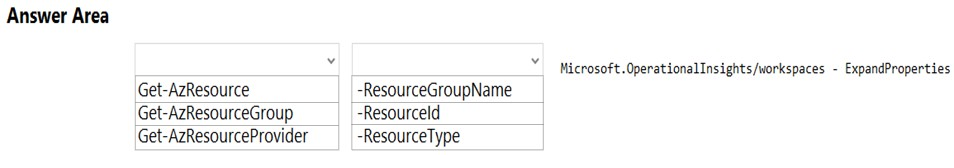

## Question 1

You manage the Git repository for a large enterprise application.

You need to minimize the data size of the repository.

How should you complete the commands?

`git gc AAAA`

-   [ ] A. --aggressive
-   [ ] B. --auto
-   [ ] C. --force
-   [ ] D. --no-prune

`git BBBB --expire now`

-   [ ] A. merge
-   [ ] B. prune
-   [ ] C. rebase
-   [ ] D. reset

<details>
    <summary>answer</summary>
    AAAA : A. --aggressive<br/>
    BBBB : B. prune<br/>
    <a href = "https://git-scm.com/docs/git-gc">https://git-scm.com/docs/git-gc</a>
</details>

---

## Question 4

You provision an Azure Kubernetes Service (AKS) cluster that has RBAC enabled. You have a Helm chart for a client application.

You need to configure Helm and Tiller on the cluster and install the chart.

Which three commands should you recommend be run in sequence?

-   [ ] A. `helm install`
-   [ ] B. `kubectl create`
-   [ ] C. `helm completion`
-   [ ] D. `helm init`
-   [ ] E. `helm serve`

<details>
    <summary>answer</summary>
    B. kubectl create<br/>
    D. helm init (unneccessary)<br/>
    A. helm install</br>
    <a href="https://learn.microsoft.com/en-us/azure/aks/kubernetes-helm"> Install existing applications with Helm in Azure Kubernetes Service (AKS) </a><br/>
    <a href="https://v2.helm.sh/docs/install/#Upgrading%20Tiller">https://v2.helm.sh/docs/install/#Upgrading%20Tiller</a>
</details>

---

## Question 5

Your company builds a multi-tier web application.

You use Azure DevOps and host the production application on Azure virtual machines.

Your team prepares an Azure Resource Manager template of the virtual machine that you will use to test new features.

You need to create a staging environment in Azure that meets the following requirements:

✑ Minimizes the cost of Azure hosting
✑ Provisions the virtual machines automatically
✑ Uses the custom Azure Resource Manager template to provision the virtual machines

What should you do?

-   [ ] A. In Azure Cloud Shell, run Azure CLI commands to create and delete the new virtual machines in a staging resource group.
-   [ ] B. In Azure DevOps, configure new tasks in the release pipeline to deploy to Azure Cloud Services.
-   [ ] C. From Azure Cloud Shell, run Azure PowerShell commands to create and delete the new virtual machines in a staging resource group.
-   [ ] D. In Azure DevOps, configure new tasks in the release pipeline to create and delete the virtual machines in Azure DevTest Labs.

<details>
    <summary>answer</summary>
    D. In Azure DevOps, configure new tasks in the release pipeline to create and delete the virtual machines in Azure DevTest Labs.</br>
    <a href="https://learn.microsoft.com/en-us/azure/devtest-labs/devtest-lab-integrate-ci-cd"> Integrate DevTest Labs into Azure Pipelines </a>
</details>

---

## Question 6

You are implementing an Azure DevOps strategy for mobile devices using App Center.

You plan to use distribution groups to control access to releases.

You need to create the distribution groups shown in the following table.

| Name   | Use                                                      |
| ------ | -------------------------------------------------------- |
| Group1 | Application tester who are invited by email              |
| Group2 | Early release users who use unauthenticated public links |
| Group3 | Application tester for all the apps of your company      |

Which type of distribution group should you use for each group?

**Group1**

-   [ ] A. Private
-   [ ] B. Public
-   [ ] C. Shared

**Group2**

-   [ ] A. Private
-   [ ] B. Public
-   [ ] C. Shared

**Group3**

-   [ ] A. Private
-   [ ] B. Public
-   [ ] C. Shared

<details>
    <summary>answer</summary>
    Group1 : A. Private</br>
    Group2 : B. Public</br>
    Group3 : C. Shared</br>
    <a href="https://learn.microsoft.com/en-us/appcenter/distribution/groups"> Manage App Center Distribution Groups </a>
</details>

---

## Question 8

You need to create deployment files for an Azure Kubernetes Service (AKS) cluster. The deployments must meet the provisioning storage requirements shown in the following table.

| deployment  | Requirement                                                             |
| ----------- | ----------------------------------------------------------------------- |
| Deployment1 | Use files stored on an SMB-based share from the container's file system |
| Deployment2 | Use files stored on a managed disk from the containers's file system    |
| Deployment3 | Securely access X/509 certificates from the containers's file system    |

Which resource type should you use for each deployment?

**Deployment1**

-   [ ] A. driver : secrets-store.csi.k9s.io
-   [ ] B. blobfuse-flexvol
-   [ ] C. provisioner:kubernetes.io/azure-disk
-   [ ] D. provisioner:kubernetes.io/azure-file
-   [ ] E. volume.beta.kubernetes.io/storage-provisioner

**Deployment2**

-   [ ] A. driver : secrets-store.csi.k9s.io
-   [ ] B. blobfuse-flexvol
-   [ ] C. provisioner:kubernetes.io/azure-disk
-   [ ] D. provisioner:kubernetes.io/azure-file
-   [ ] E. volume.beta.kubernetes.io/storage-provisioner

**Deployment3**

-   [ ] A. driver : secrets-store.csi.k9s.io
-   [ ] B. blobfuse-flexvol
-   [ ] C. provisioner:kubernetes.io/azure-disk
-   [ ] D. provisioner:kubernetes.io/azure-file
-   [ ] E. volume.beta.kubernetes.io/storage-provisioner

<details>
    <summary>answer</summary>
    Deployment1 : D. provisioner:kubernetes.io/azure-file</br>
    Deployment2 : C. provisioner:kubernetes.io/azure-disk</br>
    Deployment3 : A. driver : secrets-store.csi.k9s.io</br>
</details>

---

## Question 9

Your company uses Azure DevOps to manage the build and release processes for applications.

You use a Git repository for applications source control.

You plan to create a new branch from an existing pull request. Later, you plan to merge the new branch and the target branch of the pull request.

You need to use a pull request action to create the new branch. The solution must ensure that the branch uses only a portion of the code in the pull request.

Which pull request action should you use?

-   [ ] A. Set as default branch
-   [ ] B. Approve with suggestions
-   [ ] C. Cherry-pick
-   [ ] D. Reactivate
-   [ ] E. Revert

<details>
    <summary>answer</summary>
    C. Cherry-pick</br>
    <a href="https://learn.microsoft.com/en-us/azure/devtest-labs/devtest-lab-integrate-ci-cd"> Integrate DevTest Labs into Azure Pipelines </a>
</details>

---

## Question 12

You are finalizing a release in GitHub.

You need to apply the following labels to the release:

✑ Name

✑ Email

✑ Release v3.0

✑ Release date

How should you complete the git command?

`git AAAA BBBB v3.0 CCCC "Release v3.0"`

**AAAA**

-   [ ] A. add
-   [ ] B. commit
-   [ ] C. push
-   [ ] D. tag

**BBBB**

-   [ ] A. -a
-   [ ] B. -b
-   [ ] C. -c
-   [ ] D. -m

**CCCC**

-   [ ] A. -a
-   [ ] B. -b
-   [ ] C. -c
-   [ ] D. -m

<details>
    <summary>answer</summary>
    D. tag</br>
    A. -a</br>
    D. -m<br/>
    git tag -a v3.0 -m "Release v3.0"</br>
    <a href="https://git-scm.com/book/en/v2/Git-Basics-Tagging">2.6 Git Basics - Tagging</a>
</details>

---

## Question 13

You have a project in Azure DevOps. You have an Azure Resource Group deployment project in Microsoft Visual Studio that is checked in to theAzure DevOps project.

You need to create a release pipeline that will deploy resources by using Azure Resource Manager templates. The solution must minimize administrative effort.

Which task type should you include in the solution?

-   [ ] A. Azure Cloud Service Deployment
-   [ ] B. Azure RM Web App Deployment
-   [ ] C. Azure PowerShell
-   [ ] D. Azure App Service Manage

<details>
    <summary>answer</summary>
    C. Azure PowerShell</br>
    Use ARM template deployment task. This option is the easiest option.<br/>
    <a href="https://learn.microsoft.com/en-us/azure/azure-resource-manager/templates/add-template-to-azure-pipelines">Integrate ARM templates with Azure Pipelines</a>
</details>

---

## Question 14

Your company has a project in Azure DevOps.

You plan to create a release pipeline that will deploy resources by using Azure Resource Manager templates. The templates will reference secrets stored in Azure Key Vault.

You need to recommend a solution for accessing the secrets stored in the key vault during deployments. The solution must use the principle of least privilege.

What should you include in the recommendation?

**Restrict access to delete the key vault**

-   [ ] A. an Azure Key Vault access policy
-   [ ] B. a personal access token(PAT)
-   [ ] C. RBAC

**Restrict access to the secrets in Key Vault by using**

-   [ ] A. an Azure Key Vault access policy
-   [ ] B. a personal access token(PAT)
-   [ ] C. RBAC

<details>
    <summary>answer</summary>
    Restrict access to delete the key vault : C. RBAC</br>
    Restrict access to the secrets in Key Vault by using : A. an Azure Key Vault access policy<br/>
</details>

---

## Question 15

As part of your application build process, you need to deploy a group of resources to Azure by using an Azure Resource Manager template located on GitHub.

Which three action should you perform in sequence?

A. Set the template parameters

B. Create a package

C. Create a release pipeline

D. Create a job agent

E. Add an Azure Resource Group Deployment task

<details>
    <summary>answer</summary>
    C. Create a release pipeline</br>
    E. Add an Azure Resource Group Deployment task</br>
    A. Set the template parameters</br>
    <a href="https://learn.microsoft.com/en-us/azure/azure-resource-manager/templates/add-template-to-azure-pipelines"> Integrate ARM templates with Azure Pipelines </a>
</details>

---

## Question 18

Your company has a release pipeline in an Azure DevOps project.

You plan to deploy to an Azure Kubernetes Services (AKS) cluster by using the Helm package and deploy task.

You need to install a service in the AKS namespace for the planned deployment.

Which service should you install?

-   [ ] A. Azure Container Registry
-   [ ] B. Chart
-   [ ] C. Kubectl
-   [ ] D. Tiller

<details>
    <summary>answer</summary>
    A. Azure Container Registry</br>
</details>

---

## Question 21

Your company plans to deploy an application to the following endpoints:

✑ Ten virtual machines hosted in Azure

✑ Ten virtual machines hosted in an on-premises data center environment

All the virtual machines have the Azure Pipelines agent.

You need to implement a release strategy for deploying the application to the endpoints.

What should you recommend using to deploy the application to the endpoints?

**Ten virtual machines hosted in Azure**

-   [ ] A. A deployment group
-   [ ] B. A management group
-   [ ] C. A resource group
-   [ ] D. Application roles

**Ten virtual machines hosted in An on-premises data center environment**

-   [ ] A. A deployment group
-   [ ] B. A management group
-   [ ] C. A resource group
-   [ ] D. Application roles

<details>
    <summary>answer</summary>
    Ten virtual machines hosted in Azure : A deployment group</br>
    Ten virtual machines hosted in An on-premises data center environment : A deployment group</br>
</details>

---

## Question 22

You plan to use Terraform to deploy an Azure resource group from a Windows system.

You need to install the required frameworks to support the planned deployment.

Which two frameworks should you install? Each correct answer presents part of the solution.

NOTE: Each correct selection is worth one point.

-   [ ] A. Vault
-   [ ] B. Terratest
-   [ ] C. Node.js
-   [ ] D. Yeoman
-   [ ] E. Tiller

<details>
    <summary>answer</summary>
    B. Terratest</br>
    D. Yeoman</br>
    <a href="https://learn.microsoft.com/en-us/azure/developer/terraform/create-base-template-using-yeoman">Create a Terraform base template in Azure using Yeoman</a>
    <a href="https://learn.microsoft.com/en-us/azure/developer/terraform/test-modules-using-terratest">Test Terraform modules in Azure using Terratest</a>
</details>

---

## Question 25

You use Azure Pipelines to manage the build and deployment of apps.

You are planning the release strategies for a new app.

You need to choose strategies for the following scenarios:

✑ Releases will be made available to users who are grouped by their tolerance for software faults.

✑ Code will be deployed to enable functionality that will be available in later releases of the app.

✑ When a new release occurs, the existing deployment will remain active to minimize recovery time if a return to the previous version is required.

Which strategy should you choose for each scenario?

**Release will be made available to users who are grouped by their tolerance for software faults**

-   [ ] A. Progressive exposure
-   [ ] B. Blue/green
-   [ ] C. Feature flags

**Code will be deployed to enable functionality that will be available in later releases of the app**

-   [ ] A. Progressive exposure
-   [ ] B. Blue/green
-   [ ] C. Feature flags

**When a new release occurs, the existing deployment will remain active to minimize recovery time if a return to the previous version is required**

-   [ ] A. Progressive exposure
-   [ ] B. Blue/green
-   [ ] C. Feature flags

<details>
    <summary>answer</summary>
    <b>Release will be made available to users who are grouped by their tolerance for software faults</b> : A. Progressive exposure</br>
    <b>Code will be deployed to enable functionality that will be available in later releases of the app</b> : C. Feature flags</br>
    <b>When a new release occurs, the existing deployment will remain active to minimize recovery time if a return to the previous version is required</b> : B. Blue/green<br/>
</details>

---

## Question 28

You have an approval process that contains a condition. The condition requires that releases be approved by a team leader before they are deployed.

You have a policy stating that approvals must occur within eight hours.

You discover that deployment fail if the approvals take longer than two hours.

You need to ensure that the deployments only fail if the approvals take longer than eight hours.

Solution: From Post-deployment conditions, you modify the Time between re-evaluation of gates option.

Does this meet the goal?

-   [ ] A. Yes
-   [ ] B. No

<details>
    <summary>answer</summary>
    B. No
</details>

---

## Question 29

You have an approval process that contains a condition. The condition requires that releases be approved by a team leader before they are deployed.

You have a policy stating that approvals must occur within eight hours.

You discover that deployment fail if the approvals take longer than two hours.

You need to ensure that the deployments only fail if the approvals take longer than eight hours.

Solution: From Pre-deployment conditions, you modify the Time between re-evaluation of gates option.

Does this meet the goal?

-   [ ] A. Yes
-   [ ] B. No

<details>
    <summary>answer</summary>
    B. No<br/>
</details>

---

## Question 30

You have an approval process that contains a condition. The condition requires that releases be approved by a team leader before they are deployed.

You have a policy stating that approvals must occur within eight hours.

You discover that deployment fail if the approvals take longer than two hours.

You need to ensure that the deployments only fail if the approvals take longer than eight hours.

Solution: From Pre-deployment conditions, you modify the Timeout setting for pre-deployment approvals.

Does this meet the goal?

-   [ ] A. Yes
-   [ ] B. No

<details>
    <summary>answer</summary>
    A. Yes<br/>
</details>

---

## Question 31

You are defining release strategies for two applications as shown in the following table.

| Application | Goal                                                                                                                                                          |
| ----------- | ------------------------------------------------------------------------------------------------------------------------------------------------------------- |
| App1        | Failure of App1 has a major impact on your company. You need a small group of users , who opted in to a testing App1, to test new releases of the application |
| App2        | You need to minimize the time it takes to deploy new releases of App2, and you must be able to roll back as quickly as possible                               |

Which release strategy should you use for each application?

**App1**

-   [ ] A. Blue/Green deployment
-   [ ] B. Canary deployment
-   [ ] C. Rolling deployment

**App2**

-   [ ] A. Blue/Green deployment
-   [ ] B. Canary deployment
-   [ ] C. Rolling deployment

<details>
    <summary>answer</summary>
    App1 : B. Canary deployment<br/>
    App2 : A. Blue/Green deployment
</details>

---

## Question 34

You have a free tier of an Azure DevOps organization named Contoso. Contoso contains 10 private projects. Each project has multiple jobs with no dependencies. The build process requires access to resource files located in an on-premises file system.

You frequently run the jobs on five self-hosted agents but experience long build times and frequently queued builds.

You need to minimize the number of queued builds and the time it takes to run the builds.
What should you do?

-   [ ] A. Configure the pipelines to use the Microsoft-hosted agents.
-   [ ] B. Register additional self-hosted agents.
-   [ ] C. Purchase self-hosted parallel jobs.
-   [ ] D. Purchase Microsoft-hosted parallel jobs.

<details>
    <summary>answer</summary>
    B. Register additional self-hosted agents.<br/>
    <a href="https://learn.microsoft.com/en-us/azure/devops/pipelines/licensing/concurrent-jobs?view=azure-devops&tabs=self-hosted">Configure and pay for parallel jobs</a>
</details>

---

## Question 36

You have an Azure DevOps project named Project1 and an Azure subscription named Sub1. Sub1 contains an Azure SQL database named DB1.

You need to create a release pipeline that uses the Azure SQL Database Deployment task to update DB1.

Which artifact should you deploy?

-   [ ] A. a BACPAC
-   [ ] B. a DACPAC
-   [ ] C. an LDF file
-   [ ] D. an MDF file

<details>
    <summary>answer</summary>
    B. a DACPAC<br/>
    <a href="https://learn.microsoft.com/en-us/azure/devops/pipelines/tasks/reference/sql-azure-dacpac-deployment-v1?view=azure-pipelines&viewFallbackFrom=azure-devops">SqlAzureDacpacDeployment@1 - Azure SQL Database deployment v1 task</a>
</details>

---

## Question 37

You have a project in Azure DevOps.

You plan to create a build pipeline that will deploy resources by using Azure Resource Manager templates. The templates will reference secrets stored in Azure Key Vault.

You need to ensure that you can dynamically generate the resource ID of the key vault during template deployment.


What should you include in the template?

**1. type**

-   [ ] A. "Microsoft.KeyVault/vaults"
-   [ ] B. "Microsoft.Resources/deployments"
-   [ ] C. "Microsoft.Subscription/subscriptions"

**2.**

-   [ ] A. "deployment"
-   [ ] B. "template"
-   [ ] C. "templateLink"

<details>
    <summary>answer</summary>
    Type : "Microsoft.Resources/deployment"<br/>
    "TemplateLink"<br/>
    <a href="https://learn.microsoft.com/en-us/azure/azure-resource-manager/templates/linked-templates?tabs=azure-powershell#get-values-from-linked-template">Get values from linked template</a>
</details>

---

## Question 38

Your company has a project in Azure DevOps for a new web application.

The company uses ServiceNow for change management.

You need to ensure that a change request is processed before any components can be deployed to the production environment.

What are two ways to integrate ServiceNow into the Azure DevOps release pipeline?

-   [ ] A. Define a deployment control that invokes the ServiceNow REST API.
-   [ ] B. Define a pre-deployment gate before the deployment to the Prod stage.
-   [ ] C. Define a deployment control that invokes the ServiceNow SOAP API.
-   [ ] D. Define a post-deployment gate after the deployment to the QA stage.

<details>
    <summary>answer</summary>
    B. Define a pre-deployment gate before the deployment to the Prod stage.<br/>
    D. Define a post-deployment gate after the deployment to the QA stage.<br/>
</details>

---

## Question 39

Your company develops an application named App1 that is deployed in production.

As part of an application update, a new service is being added to App1. The new service requires access to an application named App2 that is currently in development.

You need to ensure that you can deploy the update to App1 before App2 becomes available. You must be able to enable the service in App1 once App2 is deployed.

What should you do?

-   [ ] A. Implement a feature flag.
-   [ ] B. Create a fork in the build.
-   [ ] C. Create a branch in the build.
-   [ ] D. Implement a branch policy.

<details>
    <summary>answer</summary>
    A. Implement a feature flag.<br/>
</details>

---

## Question 40

You have a private distribution group that contains provisioned and unprovisioned devices.

You need to distribute a new iOS application to the distribution group by using Microsoft Visual Studio App Center.

What should you do?

-   [ ] A. Request the Apple ID associated with the user of each device.
-   [ ] B. Register the devices on the App Developer portal.
-   [ ] C. Create an active subscription in App Center Test.
-   [ ] D. Add the device owner to the organization in App Center.

<details>
    <summary>answer</summary>
    B. Register the devices on the Apple Developer portal.<br/>
</details>

---

## Question 41

You are developing an iOS application by using Azure DevOps.

You need to test the application manually on 10 devices without releasing the application to the public.

Which two actions should you perform?

-   [ ] A. Create a Microsoft Intune device compliance policy.
-   [ ] B. Deploy a certificate from an internal certification authority (CA) to each device.
-   [ ] C. Register the application in the iTunes store.
-   [ ] D. Onboard the devices into Microsoft Intune.
-   [ ] E. Distribute a new release of the application.
-   [ ] F. Register the IDs of the devices in the Apple Developer portal.

<details>
    <summary>answer</summary>
    F. Register the IDs of the devices in the Apple Developer portal.<br/>
    D or E ? I'm not sure.<br/>
    <a href = "https://learn.microsoft.com/en-us/appcenter/distribution/auto-provisioning"> Device registration and app re-signing </a>

</details>

---

## Question 42

You have a private distribution group that contains provisioned and unprovisioned devices.

You need to distribute a new iOS application to the distribution group by using Microsoft Visual Studio App Center.

What should you do?

-   [ ] A. Select Register devices and sign my app.
-   [ ] B. Create an active subscription in App Center Test.
-   [ ] C. Create an unsigned build.
-   [ ] D. Add the device owner to the collaborators group.

<details>
    <summary>answer</summary>
    A. Select Register devices and sign my app.<br/>

</details>

---

## Question 44

Your company has an on-premises Bitbucket Server that is used for Git-based source control. The server is protected by a firewall that blocks inbound Internet traffic.

You plan to use Azure DevOps to manage the build and release processes.

Which two components are required to integrate Azure DevOps and Bitbucket?

-   [ ] A. a deployment group
-   [ ] B. a Microsoft-hosted agent
-   [ ] C. service hooks
-   [ ] D. a self-hosted agent
-   [ ] E. an External Git service connection

<details>
    <summary>answer</summary>
    D. a self-hosted agent<br/>
    E. an External Git service connection<br/>

</details>

---

## Question 45

Your company uses Git as a source code control system for a complex app named App1.

You plan to add a new functionality to App1.

You need to design a branching model for the new functionality.

Which branch lifetime and branch time should you use in the branching model?

**Branch lifetime**

-   [ ] A. Long-lived
-   [ ] B. Short-lived

**Branch type**

-   [ ] A. Master
-   [ ] B. Feature
-   [ ] C. Integration

<details>
    <summary>answer</summary>
    Branch lifetime : B. Short-lived<br/>
    Branch type : B. Feature<br/>

</details>

---

## Question 46

You have a project in Azure DevOps.

You plan to deploy a self-hosted agent by using an unattended configuration script.

Which two values should you define in the configuration script?

-   [ ] A. authorization credentials
-   [ ] B. the project name
-   [ ] C. the deployment group name
-   [ ] D. the organization URL
-   [ ] E. the agent pool name

<details>
    <summary>answer</summary>
    A. authorization credentials<br/>
    D. the organization URL<br/>
    <a href="https://learn.microsoft.com/en-us/azure/devops/pipelines/agents/windows-agent?view=azure-devops#unattended-config">Unattended config</a>
</details>

---

## Question 47

You have an Azure virtual machine named VM1 that runs Linux.

You plan to deploy the Desired State Configuration (DSC) extension to VM1.

You need to grant the Log Analytics agent the appropriate directory permissions.

How should you complete the command?


<details>
    <summary>answer</summary>
    setfacl -m u:omsagent : rwx /tmp<br/>
    <a href="https://learn.microsoft.com/en-us/azure/automation/automation-dsc-onboarding#enable-azure-vms">Enable Azure VMs</a>
</details>

---

## Question 48

You are using PowerShell to administer Azure Log Analytics workspaces.

You need to list the available workspaces and their properties.

How should you complete the command?



<details>
    <summary>answer</summary>
    Get-AzResource -ResourceType Microsoft.OperationalInsights/workspaces - ExpandProperties<br/>
    <a href="https://learn.microsoft.com/en-us/azure/automation/automation-dsc-onboarding#enable-azure-vms">Enable Azure VMs</a>
</details>

---

## Question 49

You have Azure Pipelines and GitHub integrated as a source code repository.

The build pipeline has continuous integration enabled.

You plan to trigger an automated build whenever code changes are committed to the repository.

You need to ensure that the system will wait until a build completes before queuing another build.

What should you implement?

-   [ ] A. path filters
-   [ ] B. batch changes
-   [ ] C. scheduled builds
-   [ ] D. branch filters

<details>
    <summary>answer</summary>
    B. batch changes<br/>
    <a href="https://learn.microsoft.com/en-us/azure/devops/pipelines/repos/github?view=azure-devops&tabs=yaml#batching-ci-runs">Batching CI runs</a>
</details>

---

## Question 50

You are using GitHub as a source code repository.

You create a client-side Git hook on the commit-msg event. The hook requires that each commit message contain a custom work item tag.

You need to make a commit that does not have a work item tag.

Which git commit parameter should you use?

-   [ ] A. --squash
-   [ ] B. --no-verify
-   [ ] C. --message ''
-   [ ] D. --no-post-rewrite

<details>
    <summary>answer</summary>
    B. --no-verify<br/>
    <a href="https://git-scm.com/docs/githooks">githooks - Hooks used by Git</a>
</details>

---

## Question 51

You have a private distribution group that contains provisioned and unprovisioned devices.

You need to distribute a new iOS application to the distribution group by using Microsoft Visual Studio App Center.

What should you do?

-   [ ] A. Select Register devices and sign my app.
-   [ ] B. Create an active subscription in App Center Test.
-   [ ] C. Add the device owner to the organization in App Center.
-   [ ] D. Create an unsigned build.

<details>
    <summary>answer</summary>
    A. Select Register devices and sign my app.<br/>
</details>

---

## Question 52

You need to deploy Internet Information Services (IIS) to an Azure virtual machine that runs Windows Server 2019.

How should you complete the Desired State Configuration (DSC) configuration script?


<details>
    <summary>answer</summary>
    Configuration<br/>
    WIndowsFeature<br/>
</details>

---

## Question 53

You plan to use Desired State Configuration (DSC) to maintain the configuration of a server that runs Windows Server 2019.

The server must have the following features installed:

✑ A web server
✑ An email server

How should you complete the DSC configuration file?


<details>
    <summary>answer</summary>
    "SMTP-Server", "Web-Server"<br/>
    Ensure                  <br/>
</details>

---

## Question 54

You have a private distribution group that contains provisioned and unprovisioned devices.

You need to distribute a new iOS application to the distribution group by using Microsoft Visual Studio App Center.

What should you do?

-   [ ] A. Register the devices on the Apple Developer portal.
-   [ ] B. Add the device owner to the organization in App Center.
-   [ ] C. Create an unsigned build.
-   [ ] D. Add the device owner to the collaborators group

<details>
    <summary>answer</summary>
    A. Register the devices on the Apple Developer portal.<br/>
</details>

---

## Question 55

Your company uses Azure Artifacts for package management.

You need to configure an upstream source in Azure Artifacts for Python packages.

Which repository type should you use as an upstream source?

-   [ ] A. npmjs.org
-   [ ] B. PyPI
-   [ ] C. Maven Central
-   [ ] D. third-party trusted Python

<details>
    <summary>answer</summary>
    B. PyPI<br/>
</details>

---

## Question 56

You have a GitHub repository that contains workflows. The workflows contain steps that execute predefined actions. Each action has one or more versions.

You need to request the specific version of an action to execute.

Which three attributes can you use to identify the version? Each correct answer presents a complete solution.

NOTE: Each correct selection is worth one point.

-   [ ] A. the SHA-based hashes
-   [ ] B. the tag
-   [ ] C. the runner
-   [ ] D. the branch
-   [ ] E. the serial

<details>
    <summary>answer</summary>
    A. the SHA-based hashes<br/>
    B. the tag<br/>
    D. the branch<br/>
</details>

---

## Question 57

You have an Azure subscription that contains multiple Azure pipelines.

You need to deploy a monitoring solution for the pipelines. The solution must meet the following requirements:

✑ Parse logs from multiple sources.
✑ Identify the root cause of issues.

What advanced feature of a monitoring tool should you include in the solution?

-   [ ] A. analytics
-   [ ] B. synthetic monitoring
-   [ ] C. directed monitoring
-   [ ] D. Alert Management

<details>
    <summary>answer</summary>
    A. analytics<br/>
</details>

---

## Question 58

You use Azure Pipelines to build and test a React.js application.

You have a pipeline that has a single job.

You discover that installing JavaScript packages from npm takes approximately five minutes each time you run the pipeline.

You need to recommend a solution to reduce the pipeline execution time.

Solution: You recommend using pipeline artifacts.

Does this meet the goal?

-   [ ] A. Yes
-   [ ] B. No

<details>
    <summary>answer</summary>
    B. No<br/>
</details>

---

## Question 59

You use GitHub for source control of .NET applications.

You need to deploy a documentation solution that meets the following requirements:

✑ Documents will be written in Markdown as developers make code changes.
✑ Changes to the documents will trigger the recompilation of a static website.
✑ Users will access the documents from the static website.
✑ Documents will be stored in a GitHub repository.

Which two tools can you use to compile the website? Each correct answer presents a complete solution.

NOTE: Each correct selection is worth one point.

-   [ ] A. Word Press
-   [ ] B. Jekyll
-   [ ] C. DocFX
-   [ ] D. caret
-   [ ] E. Medium

<details>
    <summary>answer</summary>
    A. Word Press<br/>
    B. Jekyll<br/>
</details>

---

## Question 60

You have an on-premises app named App1 that accesses Azure resources by using credentials stored in a configuration file.

You plan to upgrade App1 to use an Azure service principal.

What is required for App1 to programmatically sign in to Azure Active Directory (Azure AD)?

-   [ ] A. the application ID, a client secret, and the object ID
-   [ ] B. a client secret, the object ID, and the tenant ID
-   [ ] C. the application ID, a client secret, and the tenant ID
-   [ ] D. the application ID, a client secret, and the subscription ID

<details>
    <summary>answer</summary>
    C. the application ID, a client secret, and the tenant ID<br/>
    <a href="https://learn.microsoft.com/en-us/azure/devops/integrate/get-started/authentication/service-principal-managed-identity?view=azure-devops#q-can-i-use-a-service-principal-or-managed-identity-with-azure-cli">Can I use a service principal or managed identity with Azure CLI?</a>
</details>

---

## Question 61

You have a virtual machine that runs Windows Server 2019 and is managed by using Desired State Configuration (DSC).

You have the following DSC configuration

```powershell
configuration WebConfiguration
{
    File WebSiteContent{
        Ensure          = 'Present'
        SourcePath      = 'C:\test\index.htm'
        DestinationPath = 'C:\inetpub\wwwroot'
        DependsOn       = '[WindowsFeature]Web-Server'
    }

    WindowsFeature Web-Server
    {
        Ensure = 'Present'
        Name   = 'Web-Server'
    }

}
```

You have the following Local Configuration Manager(LCM) configuration

```powershell

LocalConfigurationManager
{
    ConfigurationMode              = "ApplyAndMonitor"
    RefreshFrequencyMins           = 30
    ConfigurationModeFrequencyMins = 60
    RefreshMode                    = "Push"
}

```

For each of the following statements, select Yes if the statement is true. Otherwise, select No.

**The Index.html file wii be copied to the C:\Test folder before the Web-Server Windows feature is installed.**

-   [ ] A. Yes
-   [ ] B. No

**If manual changes are made to the configuration of the virtual machine, the configuration will reapply automatically.**

-   [ ] A. Yes
-   [ ] B. No

**If the Web-Server Windows feature is uninstalled from the virtual machine, the discrepancy will be reported in a log entry within 60 minutes**

-   [ ] A. Yes
-   [ ] B. No

<details>
    <summary>answer</summary>
    B. No<br/>
    A. Yes<br/>
    B. No<br/>
</details>

---

## Question 62

You have a web app named App1 that is hosted on multiple servers. App1 uses Application Insights in Azure Monitor.

You need to compare the daily CPU usage from the last week for all servers.

How should you complete the query?


<details>
    <summary>answer</summary>
    bin(timestamp, 1d)<br/>
    render timechart<br/>
</details>

---

## Question 63

You have an Azure subscription that contains 50 virtual machines.

You plan to manage the configuration of the virtual machines by using Azure Automation State configuration.

You need to create the Desired State configuration (DSC) configuration files.

How should you structure the code blocks?

-   [ ] A. Node > configuration > Resource
-   [ ] B. configuration > Resource > Node
-   [ ] C. Resource > configuration > Node
-   [ ] D. configuration > Node > Resource

<details>
    <summary>answer</summary>
    D. configuration > Node > Resource<br/>
    <a href="https://learn.microsoft.com/en-us/powershell/dsc/configurations/configurations?view=dsc-1.1#configuration-syntax">Configuration syntax</a>
</details>

---

## Question 64

Your team uses Azure Pipelines to deploy applications.

You need to ensure that when a failure occurs during the build or release process, all the team members are notified by using Microsoft Teams.

The solution must minimize development effort.

What should you do?

-   [ ] A. Install the Azure Boards app for Teams and configure a subscription to receive notifications in a channel.
-   [ ] B. Use Azure Automation to connect to the Azure DevOps REST API and notify the team members.
-   [ ] C. Use an Azure function to connect to the Azure DevOps REST API and notify the team members.
-   [ ] D. Install the Azure Pipelines app for Teams and configure a subscription to receive notifications in a channel.

<details>
    <summary>answer</summary>
    D. Install the Azure Pipelines app for Teams and configure a subscription to receive notifications in a channel.
</details>

---

## Question 65

You have an app named App1. You have a Log Analytics workspace named Workspace1 that contains a table named AppEvents. App1 writes logs to Workspace1.

You need to query the AppEvents table. The solution must meet the following requirements:

✑ Only query rows for a column named Name that starts with the following text: "Clicked Create New Ticket."
✑ Calculate the number of daily clicks per user.
✑ Return the top 10 users based on their number of clicks for any day.
✑ Sort the results based on the highest number of clicks.
✑ Ignore any users who have less than three daily clicks.

In which order should you arrange the query statements?

A. `| summarize NumberOfClicks = count() by bin(TimeGenerated, Id), UserId`
B. `AppEvents`
C. `| Top 10 by NumberOfCLicks desc`
D. `| where NumberOfClicks >= 3`
E. `| where Name starts with "clicked Created New Ticket"`

<details>
    <summary>answer</summary>
    B. AppEvents
    E. `| where Name starts with "clicked Created New Ticket"`
    A. `| summarize NumberOfClicks = count() by bin(TimeGenerated, Id), UserId`
    D. `| where NumberOfClicks >= 3`
    C. `| Top 10 by NumberOfCLicks desc`
</details>

---

## Question 66

You have an Azure subscription that contains two resource groups named ContosoRG and ContosoDev, an Azure data factory named Contoso Data Factory, and a release pipeline in Azure Pipelines named Pipeline1.

You plan to deploy Contoso Data Factory to ContosoRG by using Pipeline1.

You add the Azure Resource Manager (ARM) template deployment task shown in the following exhibit


<details>
    <summary>answer</summary>
    Deployment mode<br/>
    location specified in the Linked artifact variable
</details>

---

## Question 67

You have an Azure Pipeline.

You need to store configuration values as variables.

At which four scopes can the variables be defined, and what is the precedence of the variables from the highest precedence to lowest precedence?

-   [ ] A. stage
-   [ ] B. job
-   [ ] C. pipeline settings UI
-   [ ] D. pipeline root
-   [ ] E. task

<details>
    <summary>answer</summary>
    A. stage<br/>
    B. job<br/>
    C. pipeline settings UI<br/>
    D. pipeline root<br/>
</details>

---

## Question 68

You have a project in Azure DevOps named Project1 that contains two environments named environment1 and environment2.

When a new version of Project is released, the latest version is deployed to environment2, and the previous version is redeployed to environment1.

You need to distribute users across the environments. The solution must meet the following requirements:

• New releases must be available to only a subset of the users.
• You must gradually increase the number of users that can access environment2.

What should you use?

A. VIP swaping
B. web app deployment slots
C. Azure Load Balancer
D. Azure Traffic Manager

<details>
    <summary>answer</summary>
    B. web app deployment slots<br/>
</details>

---

## Question 69

You are designing a versioning strategy for Git-based packages.

You plan to use a Semantic Versioning (SemVer)-based strategy.

You need to identify when to change the build version.

What should you identify for each scenario?

**You rename a parameter in an API**

-   [ ] A. Major
-   [ ] B. Minor
-   [ ] C. Patch

**You deprecate functionality in an API**

-   [ ] A. Major
-   [ ] B. Minor
-   [ ] C. Patch

**You add a feature and maintain backwards compatibility**

-   [ ] A. Major
-   [ ] B. Minor
-   [ ] C. Patch

<details>
    <summary>answer</summary>
    B. Minor<br/>
    A. Major<br/>
    C. Patch<br/>
</details>

---

## Question 71

You have an Azure subscription that uses Azure Automation State Configuration to manage the configuration of virtual machines.

You need to identify which nodes are noncompliant.

How should you complete the query?


<details>
    <summary>answer</summary>
    Resource<br/>
    OperationName<br/>
    ResultType<br/>
</details>

---

## Question 72

You have a project in Azure DevOps named Project1.

You need to ensure that all new pipelines in Project1 execute three specific tasks during pipeline execution.

What should you create?

-   [ ] A. a task group
-   [ ] B. a JSON template
-   [ ] C. a YAML template
-   [ ] D. a PowerShell task

<details>
    <summary>answer</summary>
    A. a task group<br/>
    C. a YAML template<br/>
</details>

---

## Question 73

You have a project in Azure DevOps that contains a release pipeline. The pipeline contains two stages named QA and Prod. QA deploys code to an Azure web app named webapp1. Prod deploys code to an Azure web app named webapp2.

You need to ensure that code deployments to webapp2 are blocked if Azure Application Insights generates Failed requests alerts following the deployment of new code to webapp1.

What should you do for each stage?

**QA**

-   [ ] A. Add a task to configure alert rules in Application Insights
-   [ ] B. Configure a gate in the pre-development conditions
-   [ ] C. Configure an auto-redeploy trigger in the post-deployment conditions
-   [ ] D. Configure a post-deployment approval in the post-deployment conditions

**Prod**

-   [ ] A. Add a task to configure alert rules in Application Insights
-   [ ] B. Configure a gate in the pre-development conditions
-   [ ] C. Configure an auto-redeploy trigger in the post-deployment conditions
-   [ ] D. Configure a post-deployment approval in the post-deployment conditions

<details>
    <summary>answer</summary>
    QA : A. Add a task to configure alert rules in Application Insights<br/>
    or  D. Configure a post-deployment approval in the post-deployment conditions<br/>
    Prod : B. Configure a gate in the pre-development conditions<br/>
</details>

---

## Question 74

You use Azure DevOps processes to build and deploy code.

You need to compare how much time is spent troubleshooting issues found during development and how much time is spent troubleshooting issues found in released code.

Which KPI should you use?

-   [ ] A. defect escape rate
-   [ ] B. unplanned work rate
-   [ ] C. defect rate
-   [ ] D. rework rate

<details>
    <summary>answer</summary>
    A. defect escape rate<br/>
</details>

---

## Question 75

You have a project in Azure DevOps named Project1.

You implement a Continuous Integration/Continuous Deployment (CI/CD) pipeline that uses PowerShell Desired State Configuration (DSC) to configure the application infrastructure.

You need to perform a unit test and an integration test of the configuration before Project1 is deployed.

What should you use?

-   [ ] A. the PSScriptAnalyzer tool
-   [ ] B. the Pester test framework
-   [ ] C. the PSCodeHealth module
-   [ ] D. the Test-DscConfiguration cmdlet

<details>
    <summary>answer</summary>
    B. the Pester test framework<br/>
</details>

---
