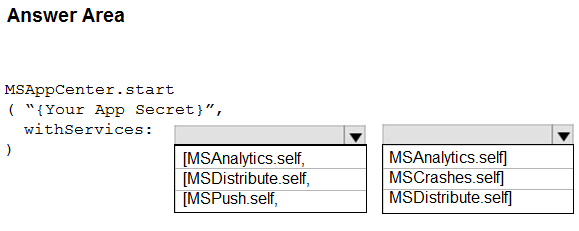
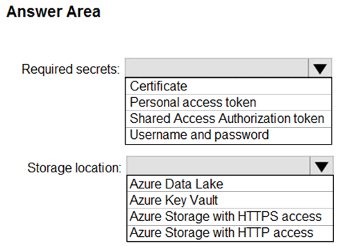
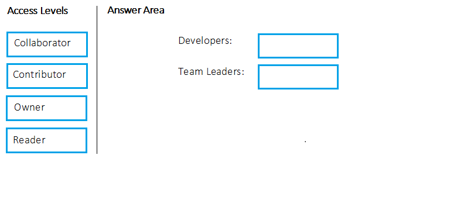
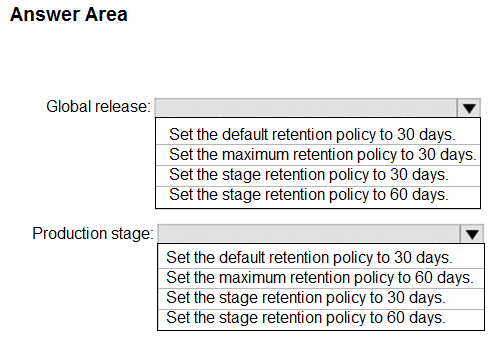

## Overview
Litware, Inc. is an independent software vendor (ISV). Litware has a main office and five branch offices.

## Existing Environment
#### Application Architecture
- The company's primary application is a single monolithic retirement fund management system based on ASP.NET web forms that use logic written in VB.NET.
- Some new sections of the application are written in C#.
- Variations of the application are created for individual customers. Currently, there are more than 80 live code branches in the application's code base.
- The application was developed by using Microsoft Visual Studio. Source code is stored in Team Foundation Server (TFS) in the main office. The branch offices access the source code by using TFS proxy servers.

#### Architectural Issues
- Litware focuses on writing new code for customers. No resources are provided to refactor or remove existing code. Changes to the code base take a long time, as dependencies are not obvious to individual developers.
- Merge operations of the code often take months and involve many developers. Code merging frequently introduces bugs that are difficult to locate and resolve.
- Customers report that ownership costs of the retirement fund management system increase continually. The need to merge unrelated code makes even minor code changes expensive.
- Customers report that bug reporting is overly complex.

## Requirements
#### Planned Changes
- Litware plans to develop a new suite of applications for investment planning. The investment planning applications will require only minor integration with the existing retirement fund management system.
- The investment planning applications suite will include one multi-tier web application and two iOS mobile applications. One mobile application will be used by employees; the other will be used by customers.
- Litware plans to move to a more agile development methodology. Shared code will be extracted into a series of packages.
- Litware has started an internal cloud transformation process and plans to use cloud-based services whenever suitable.
- Litware wants to become proactive in detecting failures, rather than always waiting for customer bug reports.

#### Technical Requirements
  The company's investment planning applications suite must meet the following technical requirements:
- New incoming connections through the firewall must be minimized.
- Members of a group named Developers must be able to install packages.
- The principle of least privilege must be used for all permission assignments.
- A branching strategy that supports developing new functionality in isolation must be used.
- Members of a group named Team Leaders must be able to create new packages and edit the permissions of package feeds.
- Visual Studio App Center must be used to centralize the reporting of mobile application crashes and device types in use.
- By default, all releases must remain available for 30 days, except for production releases, which must be kept for 60 days.
- Code quality and release quality are critical. During release, deployments must not proceed between stages if any active bugs are logged against the release.
- The mobile applications must be able to call the share pricing service of the existing retirement fund management system. Until the system is upgraded, the service will only support basic authentication over HTTPS.
-  The required operating system configuration for the test servers changes weekly. Azure Automation State Configuration must be used to ensure that the operating system on each test server is configured the same way when the servers are created and checked periodically.


## Current Technical Issue

The test servers are configured correctly when first deployed, but they experience configuration drift over time. Azure Automation State Configuration fails to correct the configurations.
Azure Automation State Configuration nodes are registered by using the following command.

```
Register-AzureRmAutomationDscNode
  -ResourceGroupName 'TestResourceGroup'
  -AutomationAccountName 'LitWareAutomationAccount'
  -AzureVMName $vmname
  -ConfigurationMode 'ApplyOnly'
```

---

## Question 1

How should you complete the code to initialize App Center in the mobile application?


<details>
    <summary>answer</summary>
    [MSAnalytics.self]<br/>
    [MSCrashes.self]<br/>
    <a href="https://learn.microsoft.com/en-us/appcenter/sdk/getting-started/ios#42-add-the-startwithservices-method">Add the start:withServices: method</a>
</details>

---

## Question 2

You need to configure a cloud service to store the secrets required by the mobile applications to call the share pricing service.

What should you include in the solution?



<details>
    <summary>answer</summary>
    Username and Password<br/>
    Azure Key Vault<br/>
</details>

---

## Question 3

Which package feed access levels should be assigned to the Developers and Team Leaders groups for the investment planning applications suite?


<details>
    <summary>answer</summary>
    Developers : Reader<br/>
    Team leaders : Owner<br/>
    <a href="https://learn.microsoft.com/en-us/azure/devops/artifacts/feeds/feed-permissions?view=azure-devops#permissions-table">Permissions table</a>
</details>

---

## Question 4

To resolve the current technical issue, what should you do to the Register-AzureRmAutomationDscNode command?

- [ ] A. Change the value of the ConfigurationMode parameter.
- [ ] B. Replace the Register-AzureRmAutomationDscNode cmdlet with Register-AzureRmAutomationScheduledRunbook
- [ ] C. Add the AllowModuleOverwrite parameter.
- [ ] D. Add the DefaultProfile parameter.

<details>
    <summary>answer</summary>
    A. Change the value of the ConfigurationMode parameter.<br/>
</details>

---

## Question 5

Which branching strategy should you recommend for the investment planning applications suite?

- [ ] A. release isolation
- [ ] B. main only
- [ ] C. development isolation
- [ ] D. feature isolation

<details>
    <summary>answer</summary>
    D. feature isolation<br/>
</details>

---

## Question 6

What should you use to implement the code quality restriction on the release pipeline for the investment planning applications suite?

- [ ] A. a pre-deployment approval
- [ ] B. a deployment gate
- [ ] C. a post-deployment approval
- [ ] D. a trigger

<details>
    <summary>answer</summary>
    A. a pre-deployment approval<br/>
</details>

---

## Question 7

How should you configure the release retention policy for the investment planning applications suite?



<details>
    <summary>answer</summary>
    Global release : Set the default retention policy to 30 days<br/>
    Production stage : Set the stage retention policy to 60 days<br/>
    <a href = "https://learn.microsoft.com/en-us/azure/devops/pipelines/policies/retention?view=azure-devops&tabs=yaml">Set retention policies for builds, releases, and tests</a>
</details>

---

## Question 8

Where should the build and release agents for the investment planning applications suite run?


<details>
    <summary>answer</summary>
    Build agent : A hosted service<br/>
    Release agent : A hosted service<br/>
</details>
