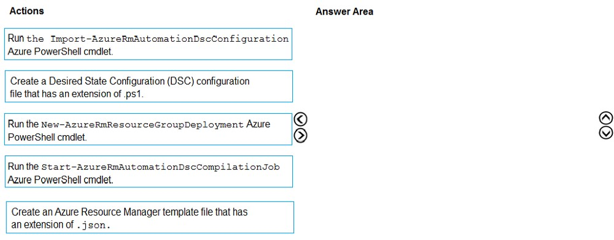

## Overview
Contoso, Ltd. is a manufacturing company that has a main office in Chicago.

## Existing Environment
Contoso plans to improve its IT development and operations processes by implementing Azure DevOps principles.

Contoso has an Azure subscription and creates an Azure DevOps organization.

The Azure DevOps organization includes:
- The Docker extension
- A deployment pool named Pool7 that contains 10 Azure virtual machines that run Windows Server 2019
- The Azure subscription contains an Azure Automation account.

## Requirements
#### Planned changes
Contoso plans to create projects in Azure DevOps as shown in the following table.

#### Technical requirements
- Contoso identifies the following technical requirements:

- Implement build agents for Project1.

- Whenever possible, use Azure resources.

- Avoid using deprecated technologies.

- Implement a code flow strategy for Project2 that will:
  - Enable Team2 to submit pull requests for Project2.
  - Enable Team2 to work independently on changes to a copy of Project2.
  - Ensure that any intermediary changes performed by Team2 on a copy of Project2 will be subject to the same restrictions as the ones defined in the build policy of Project2.

- Whenever possible, implement automation and minimize administrative effort.

- Implement Project3, Project5, Project6, and Project7 based on the planned changes.

- Implement Project4 and configure the project to push Docker images to Azure Container Registry.

---

## Question 01

You add the virtual machines as managed nodes in Azure Automation State Configuration.

You need to configure the managed computers in Pool7.

What should you do next?

- [ ] A. Modify the RefreshMode property of the Local Configuration Manager (LCM).
- [ ] B. Run the Register-AzureRmAutomationDscNode Azure Powershell cmdlet.
- [ ] C. Modify the ConfigurationMode property of the Local Configuration Manager (LCM).
- [ ] D. Install PowerShell Core.

    
answer

    B. Run the Register-AzureRmAutomationDscNode Azure Powershell cmdlet. 
    <a href="https://learn.microsoft.com/en-us/powershell/module/azurerm.automation/register-azurermautomationdscnode?view=azurermps-6.13.0">Register-AzureRmAutomationDscNode</a>

---

## Question 02

You need to implement the code flow strategy for Project2 in Azure DevOps.

Which three actions should you perform in sequence?

    
answer

    Create a repository 
    Create a fork 
    Add a build policy for the fork 

---

## Question 03

You need to configure Azure Automation for the computers in Pool7.

Which three actions should you perform in sequence?

    
answer

    Create a DesiredStateConfiguration(DSC) configuration file that has an extension of .ps1 
    Run the <b>Import-AzureRmAutomationDscConfiguration</b> Azure PowerShell cmdlet 
    Run the <b>Start-AzureRmAutomationDscCompilationJob</b> Azure PowerShell cmdlet 

---

## Question 04

How should you configure the filters for the Project5 trigger?

    
answer

    Set a <b>path filter to exclude</b> /folder1 
    Set a <b>branch filter to include</b> /. 

---

## Question 05

In Azure DevOps, you create Project3.

You need to meet the requirements of the project.

What should you do first?

- [ ] A. From Azure DevOps, modify the build definition.
- [ ] B. From SonarQube, obtain an authentication token.
- [ ] C. From Azure DevOps, create a service endpoint.
- [ ] D. From SonarQube, create a project.

    
answer

    C or D ? 

---

## Question 05

You need to implement Project4.

What should you do first?

- [ ] A. Add the FROM instruction in the Dockerfile file.
- [ ] B. Add a Copy and Publish Build Artifacts task to the build pipeline.
- [ ] C. Add a Docker task to the build pipeline.
- [ ] D. Add the MAINTAINER instruction in the Dockerfile file.

    
answer

    C. Add a Docker task to the build pipeline. 
    <a href = "https://learn.microsoft.com/en-us/azure/container-registry/container-registry-quickstart-task-cli"> Quickstart: Build and run a container image using Azure Container Registry Tasks </a>

---

## Question 06

You need to recommend a procedure to implement the build agent for Project1.

Which three actions should you recommend be performed in sequence?

    
answer

    Sign in to Azure DevOps by using an account that is assigned the agent pool administrator role 
    Create a personal access token in the Azure DevOps organization of Contoso 
    Install and register the Azure Pipelines agent on an Azure virtual machine 

---

## Question 07

You need to implement Project6.

Which three actions should you perform in sequence?

    
answer

    Open the release pipeline editor 
    Enable Gates 
    Add Query Work Items 

