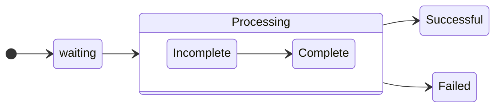

## Question 1

You need to recommend project metrics for dashboards in Azure DevOps.

Which chart widgets should you recommend for each metric? To answer, drag the appropriate chart widgets to the correct metrics.

Each chart widget may be used once, more than once, or not at all. You may need to drag the split bar between panes or scroll to view content.

NOTE: Each correct selection is worth one point.

**The elapsed time from the creation of work items to their completion**

-   [ ] Burndown
-   [ ] Cycle Time
-   [ ] Lead Time
-   [ ] Velocity

**The elapsed time to complete work items once they are active**

-   [ ] Burndown
-   [ ] Cycle Time
-   [ ] Lead Time
-   [ ] Velocity

**The remaining work**

-   [ ] Burndown
-   [ ] Cycle Time
-   [ ] Lead Time
-   [ ] Velocity
<details>
    <summary>answer</summary>
    1. Lead Time<br/>
    2. Cycle Time<br/>
    3. Burndown<br/>
    <a href="https://docs.microsoft.com/en-us/azure/devops/report/dashboards/cycle-time-and-lead-time?view=vsts">https://docs.microsoft.com/en-us/azure/devops/report/dashboards/cycle-time-and-lead-time?view=vsts</a>
</details>

---

## Question 2

You plan to create alerts that will be triggered based on the page load performance of a home page.

You have the Application Insights log query shown in the following exhibit.

```sql
requests
| where timestamp >= ago(7d)
| where operation_Name endswith('Home/Index')
| where operation_Name startswith('Get')
| summarize percentiles(duration, 50, 90, 95) by bin(timestamp, 1h)
| extend threshold = 675
| render timechart
```

**1. To create an alert based on the page load experience of most users, the alerting level must be based on**

-   [ ] percentile_duration_50
-   [ ] percentile_duration_90
-   [ ] percentile_duration_95
-   [ ] threshold

**2. To only create an alert when authentication error occurs on the server, the query must be filtered on**

-   [ ] item Type
-   [ ] resultCode
-   [ ] source
-   [ ] success

<details>
    <summary>answer</summary>
    1. percentile_duration_95<br/>
    2. success<br/>
</details>

---

## Question 3

You manage an Azure web app that supports an e-commerce website.

You need to increase the logging level when the web app exceeds normal usage patterns. The solution must minimize administrative overhead.

Which two resources should you include in the solution? Each correct answer presents part of the solution.

NOTE: Each correct selection is worth one point.

-   [ ] A. an Azure Automation runbook
-   [ ] B. an Azure Monitor alert that has a dynamic threshold
-   [ ] C. an Azure Monitor alert that has a static threshold
-   [ ] D. the Azure Monitor autoscale settings
-   [ ] E. an Azure Monitor alert that uses an action group that has an email action

<details>
    <summary>answer</summary>
    A<br/>
    B<br/>
</details>

---

## Question 4

You have an Azure Kubernetes Service (AKS) pod.

You need to configure a probe to perform the following actions:

✑ Confirm that the pod is responding to service requests.

✑ Check the status of the pod four times a minute.

✑ Initiate a shutdown if the pod is unresponsive.

How should you complete the YAML configuration file? To answer, select the appropriate options in the answer area.

```yml
apiVersion: v1
kind: Pod
metadata:
    labels:
          test: readiness-and-liveness
    name: readiness-http
spec:
    containers:
    - name: container1
      image: k9s.gcr.io/readiness-and-liveness
      - /server
```

-   [ ] livenessProbe:
-   [ ] readinessProbe:
-   [ ] ShutdownProbe:
-   [ ] startupProbe:

```yml
      - /server
        httpGet:
             path: /checknow
             port: 8123
             httpHeaders:
             - name : Custom-Header
               value: CheckNow
```

-   [ ] initialDelaySeconds: 15
-   [ ] periodSeconds: 15
-   [ ] timeoutSeconds: 15

<details>
    <summary>answer</summary>
    readinessProbe:<br/>
    periodSeconds: 15<br/>
    <a href="https://kubernetes.io/docs/tasks/configure-pod-container/configure-liveness-readiness-startup-probes/#configure-probes">Configure Probes</a>
</details>

---

## Question 5

You have a Microsoft ASP.NET Core web app in Azure that is accessed worldwide.

You need to run a URL ping test once every five minutes and create an alert when the web app is unavailable from specific Azure regions. The solution must minimize development time.

What should you do?

-   [ ] A. Create an Azure Monitor Availability metric and alert.
-   [ ] B. Create an Azure Application Insights availability test and alert.
-   [ ] C. Write an Azure function and deploy the function to the specific regions.
-   [ ] D. Create an Azure Service Health alert for the specific regions.

<details>
    <summary>answer</summary>
    B<br/>
    <a href="https://learn.microsoft.com/en-us/previous-versions/azure/azure-monitor/app/monitor-web-app-availability#create-a-url-ping-test">https://learn.microsoft.com/en-us/previous-versions/azure/azure-monitor/app/monitor-web-app-availability#create-a-url-ping-test</a>
</details>

---

## Question 6

You have a multi-tier application. The front end of the application is hosted in Azure App Service.

You need to identify the average load times of the application pages.

What should you use?

-   [ ] A. Azure Application Insights
-   [ ] B. the activity log of the App Service
-   [ ] C. the diagnostics logs of the App Service
-   [ ] D. Azure Advisor

<details>
    <summary>answer</summary>
    A<br/>
</details>

---

## Question 8

Your company uses ServiceNow for incident management.

You develop an application that runs on Azure.

The company needs to generate a ticket in ServiceNow when the application fails to authenticate.

Which Azure Log Analytics solution should you use?

-   [ ] A. Application Insights Connector
-   [ ] B. Automation & Control
-   [ ] C. IT Service Management Connector (ITSM)
-   [ ] D. Insight & Analytics

<details>
    <summary>answer</summary>
    C<br/>
    <a href="https://learn.microsoft.com/en-us/azure/azure-monitor/alerts/itsmc-overview">https://learn.microsoft.com/en-us/azure/azure-monitor/alerts/itsmc-overview</a>
</details>

---

## Question 9

Your company is building a new web application.

You plan to collect feedback from pilot users on the features being delivered.

All the pilot users have a corporate computer that has Google Chrome and the Microsoft Test & Feedback extension installed. The pilot users will test the application by using Chrome.

You need to identify which access levels are required to ensure that developers can request and gather feedback from the pilot users. The

solution must use the principle of least privilege.

Developers:

-   [ ] Basic
-   [ ] Stakeholder

Polot users:

-   [ ] Basic
-   [ ] Stakeholder

<details>
    <summary>answer</summary>
    Developers: Basic<br/>
    Polot users: Stakeholder<br/>
    <a href="https://learn.microsoft.com/en-us/azure/devops/organizations/security/access-levels?view=azure-devops&viewFallbackFrom=vsts">https://learn.microsoft.com/en-us/azure/devops/organizations/security/access-levels?view=azure-devops&viewFallbackFrom=vsts</a>
</details>

---

## Question 10

You use Azure SQL Database Intelligent Insights and Azure Application Insights for monitoring.

You need to write ad-hoc queries against the monitoring data.

Which query language should you use?

-   [ ] A. Kusto Query Language (KQL)
-   [ ] B. PL/pgSQL
-   [ ] C. PL/SQL
-   [ ] D. Transact-SQL

<details>
    <summary>answer</summary>
    A<br/>
    <a href="https://learn.microsoft.com/en-us/azure/azure-monitor/logs/log-query-overview">https://learn.microsoft.com/en-us/azure/azure-monitor/logs/log-query-overview</a>
</details>

---

## Question 11

Your company creates a web application.

You need to recommend a solution that automatically sends to Microsoft Teams a daily summary of the exceptions that occur in the application.

Which two Azure services should you recommend? Each correct answer presents part of the solution.

NOTE: Each correct selection is worth one point.

-   [ ] A. Azure Logic Apps
-   [ ] B. Azure Pipelines
-   [ ] C. Microsoft Visual Studio App Center
-   [ ] D. Azure DevOps Project
-   [ ] E. Azure Application Insights

<details>
    <summary>answer</summary>
    A, E<br/>
    <a href="https://learn.microsoft.com/en-us/azure/azure-monitor/logs/log-query-overview">https://learn.microsoft.com/en-us/azure/azure-monitor/logs/log-query-overview</a>
</details>

---

## Question 12

Your company wants to use Azure Application Insights to understand how user behaviors affect an application.

Which Application Insights tool should you use to analyze each behavior? To

**1. Feature usage:**

-   [ ] impact
-   [ ] UserFlows
-   [ ] Users

**2. Number of people who used the actions and its features:**

-   [ ] impact
-   [ ] UserFlows
-   [ ] Users

**3. The effect that the performance of the application has on the usage of a page or a feature**

-   [ ] impact
-   [ ] UserFlows
-   [ ] Users

<details>
    <summary>answer</summary>
    1. <a href="https://learn.microsoft.com/en-us/azure/azure-monitor/app/usage-flows">UserFlows</a><br/>
    2. <a href="https://learn.microsoft.com/en-us/azure/azure-monitor/app/usage-segmentation">Users</a><br/>
    3. <a href="https://learn.microsoft.com/en-us/azure/azure-monitor/app/usage-impact">impact</a><br/>
</details>

---

## Question 13

Your company is building a mobile app that targets Android and iOS devices.

Your team uses Azure DevOps to manage all work items and release cycles.

You need to recommend a solution to perform the following tasks:

✑ Collect crash reports for issue analysis.

✑ Distribute beta releases to your testers.

✑ Get user feedback on the functionality of new apps.

What should you include in the recommendation?

-   [ ] A. the Microsoft Test & Feedback extension
-   [ ] B. Microsoft Visual Studio App Center integration
-   [ ] C. Azure Application Insights widgets
-   [ ] D. Jenkins integration

<details>
    <summary>answer</summary>
    A<br/>
    <a href="https://marketplace.visualstudio.com/items?itemName=ms.vss-exploratorytesting-web">https://marketplace.visualstudio.com/items?itemName=ms.vss-exploratorytesting-web</a>
</details>

---

## Question 14

You have an Azure DevOps project named Project1 and an Azure subscription named Sub1. Sub1 contains an Azure virtual machine scale set named VMSS1.

VMSS1 hosts a web application named WebApp1. WebApp1 uses stateful sessions.

The WebApp1 installation is managed by using the Custom Script extension. The script resides in an Azure Storage account named sa1.

You plan to make a minor change to a UI element of WebApp1 and to gather user feedback about the change.

You need to implement limited user testing for the new version of WebApp1 on VMSS1.

Which three actions should you perform? 

-   [ ] A. Modify the load balancer settings of VMSS1.
-   [ ] B. Redeploy VMSS1.
-   [ ] C. Upload a custom script file to sa1.
-   [ ] D. Modify the Custom Script extension settings of VMSS1.
-   [ ] E. Update the configuration of a virtual machine in VMSS1.

<details>
    <summary>answer</summary>
    D,C,B<br/>
</details>

---

## Question 18

You have several Azure virtual machines that run Windows Server 2019.

You need to identify the distinct event IDs of each virtual machine as shown in the following table.

| Name | EventID                   |
| ---- | ------------------------- |
| VM1  | [704,701,1501,1500,1085]  |
| VM2  | [326,105,302,301,300,102] |
| ...  |                           |

How should you complete the Azure Monitor query?

```sql
Event
| where TimeGenerated > ago(12h)
| order by TimeGenerated desc
| AA BB by computer
```

AA :

-   [ ] count()
-   [ ] makelist(EventID)
-   [ ] makeset(EventID)
-   [ ] mv-expand
-   [ ] project
-   [ ] render
-   [ ] summarize

BB :

-   [ ] count()
-   [ ] makelist(EventID)
-   [ ] makeset(EventID)
-   [ ] mv-expand
-   [ ] project
-   [ ] render
-   [ ] summarize

<details>
    <summary>answer</summary>
    AA : summarize<br/>
    BB : makelist(EventID)<br/>
</details>

---

## Question 19

You have an Azure web app named Webapp1.

You need to use an Azure Monitor query to create a report that details the top 10 pages of Webapp1 that failed.

How should you complete the query?

```sql
AA
| where BB
| summarize failedCount=sum(itemCount) by name, resultCode
| top 10 by failedCount desc
| render barchart
```

AA :

-   [ ] exceptions
-   [ ] pageViews
-   [ ] requests
-   [ ] traces

BB :

-   [ ] duration == 0
-   [ ] itemType == "availabilityResult"
-   [ ] resultCode == "200"
-   [ ] success == false

<details>
    <summary>answer</summary>
    AA : requests<br/>
    BB : success == false<br/>
</details>

---

## Question 20

You are monitoring the health and performance of an Azure web app by using Azure Application Insights.

You need to ensure that an alert is sent when the web app has a sudden rise in performance issues and failures.

What should you use?

-   [ ] A. custom events
-   [ ] B. Application Insights Profiler
-   [ ] C. usage analysis
-   [ ] D. Smart Detection
-   [ ] E. Continuous export

<details>
    <summary>answer</summary>
    D<br/>
    <a href="https://learn.microsoft.com/en-us/azure/azure-monitor/alerts/proactive-diagnostics">https://learn.microsoft.com/en-us/azure/azure-monitor/alerts/proactive-diagnostics</a>
</details>

---

## Question 21

You have a project in Azure DevOps named Contoso App that contains pipelines in Azure Pipelines for GitHub repositories.

You need to ensure that developers receive Microsoft Teams notifications when there are failures in a pipeline of Contoso App.

What should you run in Teams?

```
@azure pipelines AA BB
```

AA :

-   [ ] feedback
-   [ ] signin
-   [ ] subscribe
-   [ ] subscriptions

BB :

-   [ ] https://dev.azure.com/contoso/contoso-app/
-   [ ] https://dev.azure.com/contoso/contoso-app/_build
-   [ ] https://dev.azure.com/contoso/contoso-app/_packaging
-   [ ] https://dev.azure.com/contoso/contoso-app/_work-itmes

<details>
    <summary>answer</summary>
    AA : subscribe<br/>
    BB : https://dev.azure.com/contoso/contoso-app/<br/>
</details>

---

## Question 22

You have a private GitHub repository.

You need to display the commit status of the repository on Azure Boards.
What should you do first?

-   [ ] A. Configure multi-factor authentication (MFA) for your GitHub account.
-   [ ] B. Add the Azure Pipelines app to the GitHub repository.
-   [ ] C. Add the Azure Boards app to the repository.
-   [ ] D. Create a GitHub action in GitHub.

<details>
    <summary>answer</summary>
    C<br/>
    <a href="https://learn.microsoft.com/en-us/azure/devops/boards/github/connect-to-github?view=azure-devops">https://learn.microsoft.com/en-us/azure/devops/boards/github/connect-to-github?view=azure-devops</a>
</details>

---

## Question 24

You have an Azure DevOps organization named Contoso.

You need to receive Microsoft Teams notifications when work items are updated.

What should you do?

-   [ ] A. From Azure DevOps, configure a service hook subscription
-   [ ] B. From Microsoft Teams, configure a connector
-   [ ] C. From the Microsoft Teams admin center, configure external access
-   [ ] D. From Microsoft Teams, add a channel
-   [ ] E. From Azure DevOps, install an extension

<details>
    <summary>answer</summary>
    A<br/>
    <a href="https://learn.microsoft.com/en-us/azure/devops/service-hooks/overview?view=azure-devops">https://learn.microsoft.com/en-us/azure/devops/service-hooks/overview?view=azure-devops</a>
</details>

---

## Question 25

You create an alert rule in Azure Monitor.
```
RESOURCE :
ASP-9bb7

CONDITION :
Whenever the Activity Log has an event with Category = 'Administrative' , Signal name = 'All Administrative operations', Status = 'failed'
```
Which action will trigger an alert?

-   [ ] A. a failed attempt to delete the ASP-9bb7 resource
-   [ ] B. a change to a role assignment for the ASP-9bb7 resource
-   [ ] C. a successful attempt to delete the ASP-9bb7 resource
-   [ ] D. a failed attempt to scale up the ASP-9bb7 resource

<details>
    <summary>answer</summary>
    A<br/>
    <a href="https://learn.microsoft.com/en-us/azure/azure-monitor/essentials/activity-log-schema#categories">Categories</a>
</details>

---

## Question 26

You have a web app hosted on Azure App Service. The web app stores data in an Azure SQL database.

You need to generate an alert when there are 10,000 simultaneous connections to the database. The solution must minimize development effort.

Which option should you select in the Diagnostics settings of the database?

-   [ ] A. Send to Log Analytics
-   [ ] B. Stream to an event hub
-   [ ] C. Archive to a storage account

<details>
    <summary>answer</summary>
    A<br/>
    <a href = "https://techcommunity.microsoft.com/t5/azure-database-support-blog/azure-sql-db-and-log-analytics-better-together-part-1/ba-p/794833">https://techcommunity.microsoft.com/t5/azure-database-support-blog/azure-sql-db-and-log-analytics-better-together-part-1/ba-p/794833</a>
</details>

---

## Question 27

You use Azure DevOps to manage the build and deployment of an app named App1.

You have a release pipeline that deploys a virtual machine named VM1.

You plan to monitor the release pipeline by using Azure Monitor.

You need to create an alert to monitor the performance of VM1. The alert must be triggered when the average CPU usage exceeds 70 percent for five minutes.

The alert must calculate the average once every minute.

How should you configure the alert rule?

**Aggregation granularity(Period):**

-   [ ] 1 minute
-   [ ] 5 minutes

**Threshold value:**

-   [ ] Static
-   [ ] Dynamic

**Operator:**

-   [ ] Greater than
-   [ ] Greater than or equal to
-   [ ] Less than or equal to
-   [ ] Less than

<details>
    <summary>answer</summary>
    Aggregation granularity(Period): 5 minutes<br/>
    Threshold value: Static<br/>
    Operator: Greater than<br/>
</details>

---

## Question 29

You have a project in Azure DevOps that contains a Continuous Integration/Continuous Deployment (CI/CD) pipeline.

You need to enable detailed logging by defining a pipeline variable.

How should you configure the variable?

####Name:

-   [ ] Debug
-   [ ] Log
-   [ ] System.Debug
-   [ ] System.Log

####Value:

-   [ ] 1
-   [ ] detailed
-   [ ] true

<details>
    <summary>answer</summary>
    Name:: System.Debug<br/>
    Value: true<br/>
    <a href="https://learn.microsoft.com/en-us/azure/devops/pipelines/troubleshooting/review-logs?view=azure-devops">https://learn.microsoft.com/en-us/azure/devops/pipelines/troubleshooting/review-logs?view=azure-devops</a>
</details>

---

## Question 31

You have multiple teams that work on multiple projects in Azure DevOps.

You need to plan and manage the consumers and producers for each project. The solution must provide an overview of all the projects.

What should you do?

-   [ ] A. Add a Predecessor or Successor link to the feature or user story for the items of each project.
-   [ ] B. Add a Parent or Child link to the feature or user story for the items of each project.
-   [ ] C. Install the Dependency Tracker extension and create dependencies for each project.
-   [ ] D. Create a custom query to show the consumers and producers and add a widget to a dashboard.

<details>
    <summary>answer</summary>
    C<br/>
    <a href="https://learn.microsoft.com/en-us/azure/devops/boards/extensions/dependency-tracker?view=azure-devops">https://learn.microsoft.com/en-us/azure/devops/boards/extensions/dependency-tracker?view=azure-devops</a>
</details>

---

## Question 32

You have a GitHub repository that contains the source code for an app named App1.

You need to create process documentation for App1. The solution must include a diagram that displays the relationships between the phases of

App1 as shown in the following exhibit.



How should you complete the markdown code?

````
```mermaid
AA
direction LR
[*] --> waiting
waiting --> Processing
Processing --> Successful
state BB{
    direction LR
    Incomplete --> Complete
}
Processing --> Failed
```
````

**AA**:

-   [ ] Failed
-   [ ] flowChart
-   [ ] Incomplete
-   [ ] Processing
-   [ ] sequenceDiagram
-   [ ] stateDiagram
-   [ ] waiting

**BB**:

-   [ ] Failed
-   [ ] flowChart
-   [ ] Incomplete
-   [ ] Processing
-   [ ] sequenceDiagram
-   [ ] stateDiagram
-   [ ] waiting
<details>
    <summary>answer</summary>
    AA: stateDiagram<br/>
    BB: Processing<br/>
</details>

---

## Question 33

You have an Azure web app named webapp1 that uses the .NET Core runtime stack. You have an Azure Application Insights resource named AppInsights1 that collects telemetry data generated by webapp1.

You plan to deploy webapp1 by using an Azure DevOps pipeline.

You need to modify the sampling rate of the telemetry data processed by AppInsights1 without having to redeploy webapp1 after each modification.

What should you do?

**From the code repository of webapp1**:

-   [ ] Disable adaptive sampling
-   [ ] Enable fixed-rate sampling
-   [ ] Modify ApplicationInsights.config

**From appInsights1**:

-   [ ] Configure Continuous export
-   [ ] Configure the Smart Detection settings
-   [ ] Modify the Usage and estimated costs settings
<details>
    <summary>answer</summary>
    From the code repository of webapp1: Modify ApplicationInsights.config<br/>
    From appInsights1: Modify the Usage and estimated costs settings<br/>
</details>

---

## Question 35

You have an Azure web app named webapp1 that uses the .NET Core runtime stack. You have an Azure Application Insights resource named AppInsights1. Webapp1 sends telemetry data to AppInsights1.

You need to ensure that webapp1 sends the telemetry data at a fixed sampling rate.

What should you do?

-   [ ] A. From the code repository of webapp1, modify the ApplicationInsights.config file.
-   [ ] B. From the code repository of webapp1, modify the Startup.cs file.
-   [ ] C. From AppInsights1, modify the Usage and estimated costs settings.
-   [ ] D. From AppInsights1, configure the Continuous export settings.

<details>
    <summary>answer</summary>
    A<br/>
    <a href="https://learn.microsoft.com/en-us/azure/azure-monitor/app/configuration-with-applicationinsights-config">https://learn.microsoft.com/en-us/azure/azure-monitor/app/configuration-with-applicationinsights-config</a>
</details>

---

## Question 36

You have an app named App1. You have a Log Analytics workspace named Workspace1 that contains two tables named Events and Logs. App1 manages events in multiple locations and writes logs to Workspace1.

You need to query Workspace1 for all log entries related to Asia that occurred during the last two days.

In which order should you arrange the query statements?

**A: | where continent == 'Asia'**
**B: | join ( Events**
**C: Logs**
**D: | where timestamp > ago(2d)**
**E: ) on RequestId**

<details>
    <summary>answer</summary>
    C, A, B, D, E<br/>
</details>
