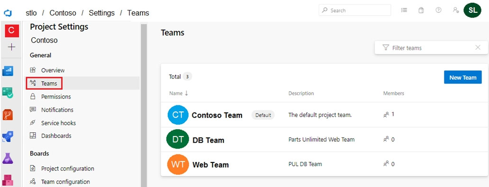
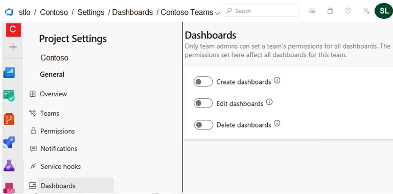

## Question 1

You have an Azure subscription that contains the resources shown in the following table.

| Name | Type               |
| ---- | ------------------ |
| DF1  | Azure Data Factory |
| SQL1 | Azure SQL Database |
| KV1  | Azure Key Vault    |

You plan to create a linked service in DF1. The linked service will connect to SQL1 by using Microsoft SQL Server authentication. The password for the SQL Server login will be stored in KV1.

You need to configure DF1 to retrieve the password when the data factory connects to SQL1. The solution must use the principle of least privilege.

How should you configure DF1?

**Permission type**

-   [ ] A. Key
-   [ ] B. Secret
-   [ ] C. Certificate

**Access method**

-   [ ] A. Access policy
-   [ ] B. Service endpoint policy
-   [ ] C. Role-based access control

<details>
    <summary>answer</summary>
    Permission type : B. Secret<br/>
    Access method : A. Access policy<br/>
    <a href = "https://docs.microsoft.com/en-us/azure/data-factory/store-credentials-in-key-vault">Store credentials in Azure Key Vault</a>
</details>

---

## Question 2

You have several Azure Active Directory (Azure AD) accounts.

You need to ensure that users use multi-factor authentication (MFA) to access Azure apps from untrusted networks.

What should you configure in Azure AD?

-   [ ] A. access reviews
-   [ ] B. managed identities
-   [ ] C. entitlement management
-   [ ] D. conditional access

<details>
    <summary>answer</summary>
    D. conditional access<br/>
    <a href = "https://learn.microsoft.com/en-us/azure/active-directory/conditional-access/howto-conditional-access-policy-all-users-mfa">Common Conditional Access policy: Require MFA for all users</a>
</details>

---

## Question 3

You plan to provision a self-hosted Linux agent.

Which authentication mechanism should you use to register the self-hosted agent?

-   [ ] A. personal access token (PAT)
-   [ ] B. SSH key
-   [ ] C. Alternate credentials
-   [ ] D. certificate

<details>
    <summary>answer</summary>
    A. personal access token (PAT)<br/>
    <a href = "https://learn.microsoft.com/en-us/azure/devops/pipelines/agents/linux-agent?view=azure-devops">Self-hosted Linux agents</a>
</details>

---

## Question 4

You are building a Microsoft ASP.NET application that requires authentication.

You need to authenticate users by using Azure Active Directory (Azure AD).

What should you do first?

-   [ ] A. Assign an enterprise application to users and groups
-   [ ] B. Create an app registration in Azure AD
-   [ ] C. Configure the application to use a SAML endpoint
-   [ ] D. Create a new OAuth token from the application
-   [ ] E. Create a membership database in an Azure SQL database

<details>
    <summary>answer</summary>
    B. Create an app registration in Azure AD<br/>
    <a href = "https://learn.microsoft.com/en-us/azure/active-directory/develop/v2-overview">What is the Microsoft identity platform</a>
</details>

---

## Question 5

You have an Azure DevOps organization named Contoso.

You need to recommend an authentication mechanism that meets the following requirements:

✑ Supports authentication from Git

✑ Minimizes the need to provide credentials during authentication

What should you recommend?

-   [ ] A. personal access tokens (PATs) in Azure DevOps
-   [ ] B. Alternate credentials in Azure DevOps
-   [ ] C. user accounts in Azure Active Directory (Azure AD)
-   [ ] D. managed identities in Azure Active Directory (Azure AD)

<details>
    <summary>answer</summary>
    A. personal access tokens (PATs) in Azure DevOps<br/>
    <a href = "https://learn.microsoft.com/en-us/azure/devops/repos/git/auth-overview?view=azure-devops">Authentication overview</a>
</details>

---

## Question 7

Your company has a project in Azure DevOps for a new web application.

The company identifies security as one of the highest priorities.

You need to recommend a solution to minimize the likelihood that infrastructure credentials will be leaked.

What should you recommend?

-   [ ] A. Add a Run Inline Azure PowerShell task to the pipeline.
-   [ ] B. Add a PowerShell task to the pipeline and run Set-AzureKeyVaultSecret.
-   [ ] C. Add an Azure Key Vault task to the pipeline.
-   [ ] D. Add Azure Key Vault references to Azure Resource Manger templates.

<details>
    <summary>answer</summary>
    B. Add a PowerShell task to the pipeline and run Set-AzureKeyVaultSecret.<br/>
    <a href = "https://learn.microsoft.com/en-us/powershell/module/azurerm.keyvault/set-azurekeyvaultsecret?view=azurermps-6.13.0">Set-AzureKeyVaultSecret</a><br/>
    <a href = "https://learn.microsoft.com/en-us/powershell/module/az.keyvault/set-azkeyvaultsecret?view=azps-9.7.1">Set-AzKeyVaultSecret</a>
</details>

---

## Question 9

You create a Microsoft ASP.NET Core application.

You plan to use Azure Key Vault to provide secrets to the application as configuration data.

You need to create a Key Vault access policy to assign secret permissions to the application. The solution must use the principle of least privilege.

Which secret permissions should you use?

-   [ ] A. List only
-   [ ] B. Get only
-   [ ] C. Get and List

<details>
    <summary>answer</summary>
    B. Get only<br/>
    <a href = "https://learn.microsoft.com/en-us/azure/key-vault/general/security-features">Azure Key Vault security</a><br/>
</details>

---

## Question 10

Your company has a project in Azure DevOps.

You plan to create a release pipeline that will deploy resources by using Azure Resource Manager templates. The templates will reference secrets stored in Azure Key Vault.

You need to recommend a solution for accessing the secrets stored in the key vault during deployments. The solution must use the principle of least privilege.

What should you include in the recommendation?

**Enable key vaults for template deployment by using**

-   [ ] A. A Key Vault access policy
-   [ ] B. A Key Vault advanced access policy
-   [ ] C. RBAC

**Restrict access to the secrets in Key Vault by using**

-   [ ] A. A Key Vault access policy
-   [ ] B. A Key Vault advanced access policy
-   [ ] C. RBAC

<details>
    <summary>answer</summary>
    Enable key vaults for template deployment by using : A. A Key Vault access policy<br/>
    Restrict access to the secrets in Key Vault by using : C. RBAC ( maybe A? I'm not sure )<br/>
    <a href = "https://learn.microsoft.com/en-us/azure/azure-resource-manager/templates/template-tutorial-use-key-vault">Integrate Azure Key Vault in your ARM template deployment</a><br/>
</details>

---

## Question 11

You need to configure access to Azure DevOps agent pools to meet the following requirements:

✑ Use a project agent pool when authoring build or release pipelines.

✑ View the agent pool and agents of the organization.

✑ Use the principle of least privilege.

Which role memberships are required for the Azure DevOps organization and the project?

**Organization :**

-   [ ] A. Administrator
-   [ ] B. Reader
-   [ ] C. Service Account
-   [ ] D. User

**Project :**

-   [ ] A. Administrator
-   [ ] B. Reader
-   [ ] C. Service Account
-   [ ] D. User

<details>
    <summary>answer</summary>
    Organization : B. Reader<br/>
    Project : D. User<br/>
    <a href = "https://learn.microsoft.com/en-us/azure/devops/pipelines/agents/pools-queues?view=azure-devops&tabs=yaml%2Cbrowser#organization-level-security-settings">Organization-level security settings</a><br/>
</details>

---

## Question 12

You have a branch policy in a project in Azure DevOps. The policy requires that code always builds successfully.

You need to ensure that a specific user can always merge changes to the master branch, even if the code fails to compile. The solution must use the principle of least privilege.

What should you do?

-   [ ] A. Add the user to the Build Administrators group.
-   [ ] B. Add the user to the Project Administrators group.
-   [ ] C. From the Security settings of the repository, modify the access control for the user.
-   [ ] D. From the Security settings of the branch, modify the access control for the user.

<details>
    <summary>answer</summary>
     D. From the Security settings of the branch, modify the access control for the user.<br/>
    <a href = "https://learn.microsoft.com/en-us/azure/devops/repos/git/branch-policies?view=azure-devops&tabs=browser">Branch policies and settings</a><br/>
</details>

---

## Question 13

You have an Azure Resource Manager template that deploys a multi-tier application.

You need to prevent the user who performs the deployment from viewing the account credentials and connection strings used by the application.

What should you use?

-   [ ] A. Azure Key Vault
-   [ ] B. a Web.config file
-   [ ] C. an Appsettings.json file
-   [ ] D. an Azure Storage table
-   [ ] E. an Azure Resource Manager parameter 􀂦le

<details>
    <summary>answer</summary>
     A. Azure Key Vault<br/>
    <a href = "https://learn.microsoft.com/en-us/azure/azure-resource-manager/templates/key-vault-parameter?tabs=azure-cli">Use Azure Key Vault to pass secure parameter value during deployment</a><br/>
</details>

---

## Question 16

Your company has an Azure subscription named Subscription1. Subscription1 is associated to an Azure Active Directory tenant named contoso.com.

You need to provision an Azure Kubernetes Services (AKS) cluster in Subscription1 and set the permissions for the cluster by using RBAC roles that reference the identities in contoso.com.

Which three objects should you create in sequence?

-   [ ] A. a system-assigned managed identity
-   [ ] B. a cluster
-   [ ] C. an application registration in contoso.com
-   [ ] D. an RBAC binding

<details>
    <summary>answer</summary>
     B. a cluster<br/>
     A. a system-assigned managed identity<br/>
     D. an RBAC binding<br/>
    <a href = "https://learn.microsoft.com/en-us/azure/aks/use-managed-identity">Use a managed identity in Azure Kubernetes Service (AKS)</a><br/>
</details>

---

## Question 17

You manage build and release pipelines by using Azure DevOps. Your entire managed environment resides in Azure.

You need to configure a service endpoint for accessing Azure Key Vault secrets. The solution must meet the following requirements:

✑ Ensure that the secrets are retrieved by Azure DevOps.

✑ Avoid persisting credentials and tokens in Azure DevOps.

How should you configure the service endpoint?

**Service connection type**

-   [ ] A. Azure Resource Manager
-   [ ] B. Generic service
-   [ ] C. Team Foundation Server / Azure Pipelines service connection

**Authentication/authorization method for the connection**

-   [ ] A. Azure Active Directory OAuth 2.0
-   [ ] B. Grant authorization
-   [ ] C. Managed Service Identity Authentication

<details>
    <summary>answer</summary>
     Service connection type : C. Team Foundation Server / Azure Pipelines service connection<br/>
     <a href = "https://learn.microsoft.com/en-us/azure/devops/pipelines/tasks/reference/azure-key-vault-v2?view=azure-pipelines&viewFallbackFrom=azure-devops">AzureKeyVault@2 - Azure Key Vault v2 task</a><br/>
     Authentication/authorization method for the connection : C. Managed Service Identity Authentication<br/>
    <a href = "https://learn.microsoft.com/en-us/azure/active-directory/managed-identities-azure-resources/overview">What are managed identities for Azure resources?</a><br/>
</details>

---

## Question 18

You are deploying a server application that will run on a Server Core installation of Windows Server 2019.

You create an Azure key vault and a secret.

You need to use the key vault to secure API secrets for third-party integrations.

Which three actions should you perform? Each correct answer presents part of the solution.

NOTE: Each correct selection is worth one point.

-   [ ] A. Configure RBAC for the key vault.
-   [ ] B. Modify the application to access the key vault.
-   [ ] C. Configure a Key Vault access policy.
-   [ ] D. Deploy an Azure Desired State Configuration (DSC) extension.
-   [ ] E. Deploy a virtual machine that uses a system-assigned managed identity.

<details>
    <summary>answer</summary>
     B. Modify the application to access the key vault.<br/>
     C. Configure a Key Vault access policy.<br/>
     E. Deploy a virtual machine that uses a system-assigned managed identity.<br/>
    <a href = "https://learn.microsoft.com/en-us/azure/active-directory/managed-identities-azure-resources/overview">What are managed identities for Azure resources?</a><br/>
    <a href = "https://learn.microsoft.com/en-us/azure/key-vault/general/assign-access-policy?tabs=azure-portal">Assign a Key Vault access policy</a><br/>
</details>

---

## Question 19

Your company is creating a suite of three mobile applications.

You need to control access to the application builds. The solution must be managed at the organization level.

What should you use?

**Groups to control the build access**

-   [ ] A. Active Directory groups
-   [ ] B. Azure Active Directory groups
-   [ ] C. Microsoft visual Studio App Center distribution groups

**Group Type**

-   [ ] A. Private
-   [ ] B. Public
-   [ ] C. Shared

<details>
    <summary>answer</summary>
     Groups to control the build access :  C. Microsoft visual Studio App Center distribution groups<br/>
     Groups Type :  C. Shared<br/>
     <a href = "https://learn.microsoft.com/en-us/appcenter/distribution/groups">Manage App Center Distribution Groups</a><br/>
</details>

---

## Question 21

Your company uses Azure DevOps.

Only users who have accounts in Azure Active Directory can access the Azure DevOps environment.

You need to ensure that only devices that are connected to the on-premises network can access the Azure DevOps environment.

What should you do?

-   [ ] A. Assign the Stakeholder access level to all users.
-   [ ] B. In Azure Active Directory, configure risky sign-ins.
-   [ ] C. In Azure DevOps, configure Security in Project Settings.
-   [ ] D. In Azure Active Directory, configure conditional access.

<details>
    <summary>answer</summary>
     D. In Azure Active Directory, configure conditional access.<br/>
    <a href = "https://learn.microsoft.com/en-us/azure/active-directory/conditional-access/overview">What is Conditional Access?</a><br/>
</details>

---

## Question 22

You assign the policy to the Tenant root group.

```
if:{
    allof:[
        {
            "field":"type",
            "equals":"Microsoft.Storage/storageAccounts"
        },
        {
            "field":"Microsoft.Storage/storageAccounts/supportsHttpsTrafficOnly",
            "notEquals":"true"
        }
   ]
},
then:{
    effect:"deny"
}

```

What is the effect of the policy?

-   [ ] A. prevents all HTTP traffic to existing Azure Storage accounts
-   [ ] B. ensures that all traffic to new Azure Storage accounts is encrypted
-   [ ] C. prevents HTTPS traffic to new Azure Storage accounts when the accounts are accessed over the Internet
-   [ ] D. ensures that all data for new Azure Storage accounts is encrypted at rest

<details>
    <summary>answer</summary>
     B. ensures that all traffic to new Azure Storage accounts is encrypted.<br/>
</details>

---

## Question 23

You have an Azure DevOps organization named Contoso, an Azure DevOps project named Project1, an Azure subscription named Sub1, and an
Azure key vault named vault1.

You need to ensure that you can reference the values of the secrets stored in vault1 in all the pipelines of Project1. The solution must prevent the values from being stored in the pipelines.

What should you do?

-   [ ] A. Create a variable group in Project1.
-   [ ] B. Add a secure file to Project1.
-   [ ] C. Modify the security settings of the pipelines.
-   [ ] D. Configure the security policy of Contoso.

<details>
    <summary>answer</summary>
    A. Create a variable group in Project1.<br/>
    <a href = "https://learn.microsoft.com/en-us/azure/devops/pipelines/library/variable-groups?view=azure-devops&tabs=classic">Add & use variable groups</a><br/>
</details>

---

## Question 25

You are configuring an Azure DevOps deployment pipeline. The deployed application will authenticate to a web service by using a secret stored in an Azure key vault.

You need to use the secret in the deployment pipeline.

Which three actions should you perform in sequence?

-   [ ] A. Create a service principal in Azure Active Directory(Azure AD)
-   [ ] B. Add an app registration in Azure Active Directory(Azure AD)
-   [ ] C. Configure an access policy in the key vault
-   [ ] D. Generate a self-signed certificate
-   [ ] E. Add an Azure Resource manager service connection to the pipeline
-   [ ] F. Export a certificate from the key vault

<details>
    <summary>answer</summary>
    A. C. E.<br/>
</details>

---

## Question 26

You have a private project in Azure DevOps and two users named User1 and User2.

You need to add User1 and User2 to groups to meet the following requirements:

✑ User1 must be able to create a code wiki.

✑ User2 must be able to edit wiki pages.

✑ The solution must use the principle of least privilege.

To which group should you add each user?

**User1**

-   [ ] A. Build Administrators
-   [ ] B. Contributors
-   [ ] C. Project Administrators
-   [ ] D. Project Valid Users
-   [ ] E. Stakeholders

**User2**

-   [ ] A. Build Administrators
-   [ ] B. Contributors
-   [ ] C. Project Administrators
-   [ ] D. Project Valid Users
-   [ ] E. Stakeholders

<details>
    <summary>answer</summary>
    User1 : Project Administrators<br/>
    User2 : Contributor<br/>
    <a href="https://learn.microsoft.com/en-us/azure/devops/project/wiki/wiki-create-repo?view=azure-devops&tabs=browser">Create a wiki for your project</a>
</details>

---

## Question 27

You use WhiteSource Bolt to scan a Node.js application.

The WhiteSource Bolt scan identifies numerous libraries that have invalid licenses. The libraries are used only during development and are not part of a production deployment.

You need to ensure that WhiteSource Bolt only scans production dependencies.

Which two actions should you perform? Each correct answer presents part of the solution.

NOTE: Each correct selection is worth one point.

-   [ ] A. Run npm install and specify the --production fag.
-   [ ] B. Modify the WhiteSource Bolt policy and set the action for the licenses used by the development tools to Reassign.
-   [ ] C. Modify the devDependencies section of the project's Package.json file.
-   [ ] D. Configure WhiteSource Bolt to scan the node_modules directory only.

<details>
    <summary>answer</summary>
    A, C<br/>
</details>

---

## Question 28

You plan to update the Azure DevOps strategy of your company.

You need to identify the following issues as they occur during the company's development process:

✑ Licensing violations

✑ Prohibited libraries

Solution: You implement continuous integration.

Does this meet the goal?

-   [ ] A. Yes
-   [ ] B. No

<details>
    <summary>answer</summary>
    A<br/>
    <a href="https://learn.microsoft.com/en-us/training/modules/introduction-to-secure-devops/5-explore-key-validation-points?pivots=powershell">Explore key validation points</a>
</details>

---

## Question 29

You plan to update the Azure DevOps strategy of your company.

You need to identify the following issues as they occur during the company's development process:

✑ Licensing violations

✑ Prohibited libraries

Solution: You implement pre-deployment gates.

Does this meet the goal?

-   [ ] A. Yes
-   [ ] B. No

<details>
    <summary>answer</summary>
    B<br/>
</details>

---

## Question 30

You plan to update the Azure DevOps strategy of your company.

You need to identify the following issues as they occur during the company's development process:

✑ Licensing violations

✑ Prohibited libraries

Solution: You implement automated security testing.

Does this meet the goal?

-   [ ] A. Yes
-   [ ] B. No

<details>
    <summary>answer</summary>
    B<br/>
</details>

---

## Question 31

You plan to update the Azure DevOps strategy of your company.

You need to identify the following issues as they occur during the company's development process:

✑ Licensing violations

✑ Prohibited libraries

Solution: You implement continuous deployment.

Does this meet the goal?

-   [ ] A. Yes
-   [ ] B. No

<details>
    <summary>answer</summary>
    B<br/>
</details>

---

## Question 33

Your company has an Azure subscription.

The company requires that all resource groups in the subscription have a tag named organization set to a value of Contoso.

You need to implement a policy to meet the tagging requirement.

How should you complete the policy?

```
{
"policyRule":{
    "if":{
        "allof":[
            {
                "field":"type",
                "equals":
```

-   [ ] A. "MicrosoftResource/deployments"
-   [ ] A. "MicrosoftResource/subscriptions"
-   [ ] A. "MicrosoftResource/subscriptions/resourceGroups"

```
                },
                {
                "not":{
                    "field":"tags['organization']",
                    "equals":"Contoso"
                }
            }
        ]
    },
    "then":{
        "effect":
```

-   [ ] A. "Append",
-   [ ] A. "Deny",
-   [ ] A. "DeployIfNotExists",

```
        "details":[
            {
                "field":"tags['organization']",
                "value":"Contoso"
            }
        ]
    }
}
}
```

<details>
    <summary>answer</summary>
    A, A<br/>
</details>

---

## Question 35

You have an Azure DevOps project named Project1 and an Azure subscription named Sub1.

You need to prevent releases from being deployed unless the releases comply with the Azure Policy rules assigned to Sub1.

What should you do in the release pipeline of Project1?

-   [ ] A. Add a deployment gate.
-   [ ] B. Modify the Deployment queue settings.
-   [ ] C. Configure a deployment trigger.
-   [ ] D. Create a pipeline variable.

<details>
    <summary>answer</summary>
    A<br/>
</details>

---

## Question 36

You have an Azure Kubernetes Service (AKS) implementation that is RBAC-enabled.

You plan to use Azure Container Instances as a hosted development environment to run containers in the AKS implementation.

You need to configure Azure Container Instances as a hosted environment for running the containers in AKS.

Which three actions should you perform in sequence?

A. Run `helm init.`
B. Run `az aks install-connector`
C. Create a YAML file
D. Run `az role assignment create`
E. Run `kubectl apply`

<details>
    <summary>answer</summary>
    C, E, A<br/>
    <a href="https://learn.microsoft.com/en-us/azure/aks/learn/quick-kubernetes-deploy-cli">Quickstart: Deploy an Azure Kubernetes Service (AKS) cluster using Azure CLI</a>
</details>

---

## Question 37

You have an Azure DevOps project that contains a build pipeline. The build pipeline uses approximately 50 open source libraries.

You need to ensure that all the open source libraries comply with your company's licensing standards.

Which service should you use?

-   [ ] A. Ansible
-   [ ] B. Maven
-   [ ] C. WhiteSource Bolt
-   [ ] D. Helm

<details>
    <summary>answer</summary>
    C
</details>

---

## Question 37

You administer an Azure DevOps project that includes package feeds.

You need to ensure that developers can unlist and deprecate packages. The solution must use the principle of least privilege.

Which access level should you grant to the developers?

A. Collaborator
B. Contributor
C. Owner

<details>
    <summary>answer</summary>
    B
</details>

---

## Question 40

You have a project in Azure DevOps that has three teams as shown in the Teams exhibit

You create a new dashboard named Dash1.
You configure the dashboard permissions for the Contoso project as shown in the Permissions exhibit.

All other permissions have the default values set.
**Web Team can delete Dash1**

-   [ ] Yes
-   [ ] No

**Contoso Team can view Dash1**

-   [ ] Yes
-   [ ] No

**Project administrators can create new dashboards**

-   [ ] Yes
-   [ ] No
<details>
    <summary>answer</summary>
    Web Team can delete Dash1 : No</br>
    Contoso Team can view Dash1 : Yes</br>
    Project administrators can create new dashboards : Yes</br>
</details>

---

## Question 41

Your company is concerned that when developers introduce open source libraries, it creates licensing compliance issues.

You need to add an automated process to the build pipeline to detect when common open source libraries are added to the code base.

What should you use?

-   [ ] A. Microsoft Visual SourceSafe
-   [ ] B. Code Style
-   [ ] C. Black Duck
-   [ ] D. Jenkins

<details>
    <summary>answer</summary>
    C
</details>

---

## Question 42

You are implementing a package management solution for a Node.js application by using Azure Artifacts.

You need to configure the development environment to connect to the package repository. The solution must minimize the likelihood that credentials will be leaked.

Which file should you use to configure each connection?

**Feed registry information**

-   [ ] A. The .npmrc file in the project
-   [ ] B. The .npmrc file in the user's home folder
-   [ ] C. The Package.json file in the project
-   [ ] D. The Project.json file in the project

**Credentials**

-   [ ] A. The .npmrc file in the project
-   [ ] B. The .npmrc file in the user's home folder
-   [ ] C. The Package.json file in the project
-   [ ] D. The Project.json file in the project

<details>
    <summary>answer</summary>
    Feed registry information : A. The .npmrc file in the project</br>
    Credentials : B. The .npmrc file in the user's home folder</br>
    <a href="https://learn.microsoft.com/en-us/azure/devops/artifacts/npm/npmrc?view=azure-devops&tabs=windows%2Cclassic">Set up your project and connect to Azure Artifacts</a>
</details>

---

## Question 43

You have an Azure DevOps project that contains a build pipeline. The build pipeline uses approximately 50 open source libraries.

You need to ensure that the project can be scanned for known security vulnerabilities in the open source libraries.

What should you do?

**Object to create**

-   [ ] A. A build task
-   [ ] B. A deployment task
-   [ ] C. An artifacts repository

**Service to use**

-   [ ] A. WhiteSource Bolt
-   [ ] B. Bamboo
-   [ ] C. CMake
-   [ ] D. Chef

<details>
    <summary>answer</summary>
    Object to create : A. A build task</br>
    Service to use : A. WhiteSource Bolt</br>
</details>

---

## Question 44

You have an Azure DevOps project that contains a build pipeline. The build pipeline uses approximately 50 open source libraries.

You need to ensure that all the open source libraries comply with your company's licensing standards.

Which service should you use?

-   [ ] A. NuGet
-   [ ] B. Maven
-   [ ] C. Black Duck
-   [ ] D. Helm

<details>
    <summary>answer</summary>
    C. Black Duck</br>
</details>

---

## Question 46

Your company develops an app for iOS. All users of the app have devices that are members of a private distribution group in Microsoft Visual Studio App Center.

You plan to distribute a new release of the app.

You need to identify which certificate file you require to distribute the new release from App Center.

Which file type should you upload to App Center?

-   [ ] A. .cer
-   [ ] B. .pfx
-   [ ] C. .p12
-   [ ] D. .pvk

<details>
    <summary>answer</summary>
    C. .p12</br>
    <a href="https://learn.microsoft.com/en-us/appcenter/build/xamarin/ios/">Building Xamarin apps for iOS</a>
</details>

---

## Question 48

You have a project in Azure DevOps named Project1 that contains two Azure DevOps pipelines named Pipeline1 and Pipeline2.

You need to ensure that Pipeline1 can deploy code successfully to an Azure web app named webapp1. The solution must ensure that Pipeline2 does not have permission to webapp1.

Which three actions should you perform in sequence?

-   [ ] A. Create a service principal in Azure Active Directory
-   [ ] B. In Project1, create a service connection
-   [ ] C. In Pipeline1, authorize the service connection
-   [ ] D. Create a system-assigned managed identity in Azure Active Directory
-   [ ] E. In Project1, configure permissions
-   [ ] F. In Pipeline1, create a variable

<details>
    <summary>answer</summary>
    A. Create a service principal in Azure Active Directory</br>
    B. In Project1, create a service connection<br/>
    E. In Project1, configure permissions<br/>
    <a href="https://learn.microsoft.com/en-us/azure/devops/pipelines/library/connect-to-azure?view=azure-devops#create-an-azure-resource-manager-service-connection-with-an-existing-service-principal">Create an Azure Resource Manager service connection with an existing service principal</a>
</details>

---

## Question 49

You need to increase the security of your team's development process.

Which type of security tool should you recommend for each stage of the development process?

**Pull request**

-   [ ] A. Penetration Testing
-   [ ] B. Static code analysis
-   [ ] C. Threat modeling

**Continuous integration**

-   [ ] A. Penetration Testing
-   [ ] B. Static code analysis
-   [ ] C. Threat modeling

**Continuous delivery**

-   [ ] A. Penetration Testing
-   [ ] B. Static code analysis
-   [ ] C. Threat modeling

<details>
    <summary>answer</summary>
    Pull request : B. Static code analysis</br>
    Continuous integration : B. Static code analysis<br/>
    Continuous delivery : A. Penetration Testing<br/>
    <a href="https://learn.microsoft.com/en-us/azure/devops/pipelines/library/connect-to-azure?view=azure-devops#create-an-azure-resource-manager-service-connection-with-an-existing-service-principal">Create an Azure Resource Manager service connection with an existing service principal</a>
</details>

---

## Question 50

Your company is concerned that when developers introduce open source libraries, it creates licensing compliance issues.

You need to add an automated process to the build pipeline to detect when common open source libraries are added to the code base.

What should you use?

-   [ ] A. OWASP ZAP
-   [ ] B. Jenkins
-   [ ] C. Code Style
-   [ ] D. WhiteSource Bolt

<details>
    <summary>answer</summary>
    D. WhiteSource Bolt</br>
</details>

---

## Question 51

You plan to use a NuGet package in a project in Azure DevOps. The NuGet package is in a feed that requires authentication.

You need to ensure that the project can restore the NuGet package automatically.

What should the project use to automate the authentication?

-   [ ] A. an Azure Automation account
-   [ ] B. an Azure Artifacts Credential Provider
-   [ ] C. an Azure Active Directory (Azure AD) account that has multi-factor authentication (MFA) enabled
-   [ ] D. an Azure Active Directory (Azure AD) service principal

<details>
    <summary>answer</summary>
    B. an Azure Artifacts Credential Provider</br>
    <a href="https://github.com/Microsoft/artifacts-credprovider">Azure Artifacts Credential Provider</a>
</details>

---

## Question 52

You use Azure Pipelines to manage project builds and deployments.

You plan to use Azure Pipelines for Microsoft Teams to notify the legal team when a new build is ready for release.

You need to configure the Organization Settings in Azure DevOps to support Azure Pipelines for Microsoft Teams.

What should you turn on?

-   [ ] A. Third-party application access via OAuth
-   [ ] B. Azure Active Directory Conditional Access Policy Validation
-   [ ] C. Alternate authentication credentials
-   [ ] D. SSH authentication

<details>
    <summary>answer</summary>
    A. Third-party application access via OAuth</br>
    <a href="https://learn.microsoft.com/en-us/azure/devops/pipelines/integrations/microsoft-teams?view=azure-devops">Use Azure Pipelines with Microsoft Teams</a>
</details>

---

## Question 53

You have an existing project in Azure DevOps.

You plan to integrate GitHub as the repository for the project.

You need to ensure that Azure Pipelines runs under the Azure Pipelines identity.

Which authentication mechanism should you use?

-   [ ] A. personal access token (PAT)
-   [ ] B. GitHub App
-   [ ] C. Azure Active Directory (Azure AD)
-   [ ] D. OAuth

<details>
    <summary>answer</summary>
    B. GitHub App</br>
    <a href="https://learn.microsoft.com/en-us/azure/devops/pipelines/repos/github?view=azure-devops&tabs=yaml#access-to-github-repositories">Access to GitHub repositories</a>
</details>

---

## Question 54

You have an Azure subscription that uses Azure Monitor and contains a Log Analytics workspace.

You have an encryption key.

You need to configure Azure Monitor to use the key to encrypt log data.

Which five actions should you perform in sequence?

-   [ ] A. Configure the key vault properties for the cluster
-   [ ] B. Link the Log Analytics workspace to the cluster
-   [ ] C. Grant the system-assigned managed identity Key Permission for the key vault
-   [ ] D. Grant the system-assigned managed identity Certificate permission for the key vault
-   [ ] E. Create an Azure Monitor Logs dedicated cluster that has a system-assigned managed identity
-   [ ] F. Create an Azure key vault and store the key

<details>
    <summary>answer</summary>
    F. Create an Azure key vault and store the key</br>
    E. Create an Azure Monitor Logs dedicated cluster that has a system-assigned managed identity<br/>
    C. Grant the system-assigned managed identity Key Permission for the key vault<br/>
    A. Configure the key vault properties for the cluster<br/>
    B. Link the Log Analytics workspace to the cluster<br/>
    <a href="https://learn.microsoft.com/en-us/azure/azure-monitor/logs/customer-managed-keys?tabs=portal">Azure Monitor customer-managed key</a>

</details>

---

## Question 56

You use release pipelines in Azure Pipelines to deploy an app. Secrets required be the pipeline are stored as pipeline variables.

Logging of commands is enabled for the Azure Pipelines agent.

You need to prevent the values of the secrets from being logged.

What should you do?

-   [ ] A. Store the secrets in the environment variables instead of the pipeline variables.
-   [ ] B. Pass the secrets on the command line instead of in the pipeline variables.
-   [ ] C. Apply a prefix of secret to the name of the variables.
-   [ ] D. Echo the values of the secrets to the command line.

<details>
    <summary>answer</summary>
    A. Store the secrets in the environment variables instead of the pipeline variables.<br/>
    <a href="https://learn.microsoft.com/en-us/azure/devops/pipelines/process/variables?view=azure-devops&tabs=yaml%2Cbatch#secret-variables">Set secret variables</a>

</details>

---

## Question 57

You need to deploy a new project in Azure DevOps that has the following requirements:

-   The lead developer must be able to create repositories, manage permissions, manage policies, and contribute to the repository.
-   Developers must be able to contribute to the repository and create branches, but NOT bypass policies when pushing builds.
-   Project managers must only be able to view the repository.
-   The principle of least privilege must be used.

You create a new Azure DevOps project team for each role.

To which Azure DevOps groups should you add each team?

**Project manager**

-   [ ] A. Build Administrators
-   [ ] B. Contributors
-   [ ] C. Project Administrators
-   [ ] D. Project Collection Administrators
-   [ ] E. Project Collection Valid Users
-   [ ] F. Readers

**Lead developer**

-   [ ] A. Build Administrators
-   [ ] B. Contributors
-   [ ] C. Project Administrators
-   [ ] D. Project Collection Administrators
-   [ ] E. Project Collection Valid Users
-   [ ] F. Readers

**Developer**

-   [ ] A. Build Administrators
-   [ ] B. Contributors
-   [ ] C. Project Administrators
-   [ ] D. Project Collection Administrators
-   [ ] E. Project Collection Valid Users
-   [ ] F. Readers

<details>
    <summary>answer</summary>
    Project manager : F. Reader<br/>
    Lead developer : C. Project Administrators<br/>
    Developer : B. Contributors<br/>

</details>

---

## Question 58

You have an Azure subscription that contains a project in Azure DevOps named Project1. You have three Azure Active Directory (Azure AD) users that require access to Project1 as shown in the following table.

| Name  | Title            | Requirement                                |
| ----- | ---------------- | ------------------------------------------ |
| User1 | Project Manager  | View repositories                          |
| User2 | Development Lead | Create repositories and manage permissions |
| User3 | Developer        | Create branches and tags                   |

You need to ensure that the users have the appropriate permissions. The solution must use the principle of least privilege.

To which permission group in Azure DevOps should you add each user?

**User1**

-   [ ] A. Build Administrators
-   [ ] B. Contributors
-   [ ] C. Project Administrators
-   [ ] D. Readers

**User2**

-   [ ] A. Build Administrators
-   [ ] B. Contributors
-   [ ] C. Project Administrators
-   [ ] D. Readers

**User3**

-   [ ] A. Build Administrators
-   [ ] B. Contributors
-   [ ] C. Project Administrators
-   [ ] D. Readers

<details>
    <summary>answer</summary>
    User1 : D. Reader<br/>
    User2 : C. Project Administrators<br/>
    User3 : B. Contributors<br/>

</details>

---

## Question 59

You have an Azure subscription linked to an Azure Active Directory Premium Plan 1 tenant.

A security review indicates that too many users have privileged access to resources.

You need to deploy a privileged access management solution that meets the following requirements:

• Enforces time limits on the use of privileged access
• Requires approval to activate privileged access
• Minimizes costs

What should you do first?

-   [ ] A. Configure notifications when privileged roles are activated.
-   [ ] B. Configure alerts for the activation of privileged roles.
-   [ ] C. Enforce Azure Multi-Factor Authentication (MFA) for role activation.
-   [ ] D. Upgrade the license of the Azure Active Directory (Azure AD) tenant.

<details>
    <summary>answer</summary>
    D<br/>

</details>

---

## Question 60

You plan to create a GitHub workflow that will use GitHub Actions. The actions will require a 256-KB secret.

You need to recommend a solution to store and encrypt the secret. The secret value must be accessible only to the workflow. The solution must minimize administrative effort

What should you recommend?

-   [ ] A. Store the secret in the organization-level GitHub secrets.
-   [ ] B. Store the secret in the repository-level GitHub secrets.
-   [ ] C. Encrypt the secret value and store the value in the repository. Store the decryption key in the repository-level GitHub secrets.
-   [ ] D. Encrypt the secret value and store the value in the repository. Store the decryption key in the organization-level GitHub secrets.

<details>
    <summary>answer</summary>
    D<br/>

</details>

---

## Question 61

You have a GitHub Enterprise account.

You need to enable push protection for secret scanning of the account repositories.
What should you do first?

-   [ ] A. Purchase a GitHub Advanced Security license.
-   [ ] B. Purchase Premium Plus support.
-   [ ] C. Enforce multi-factor authentication (MFA).
-   [ ] D. Create an access policy for secrets.

<details>
    <summary>answer</summary>
    D<br/>

</details>

---
