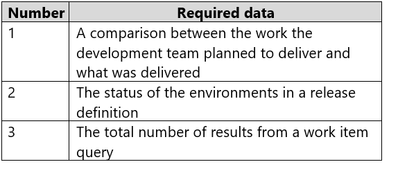
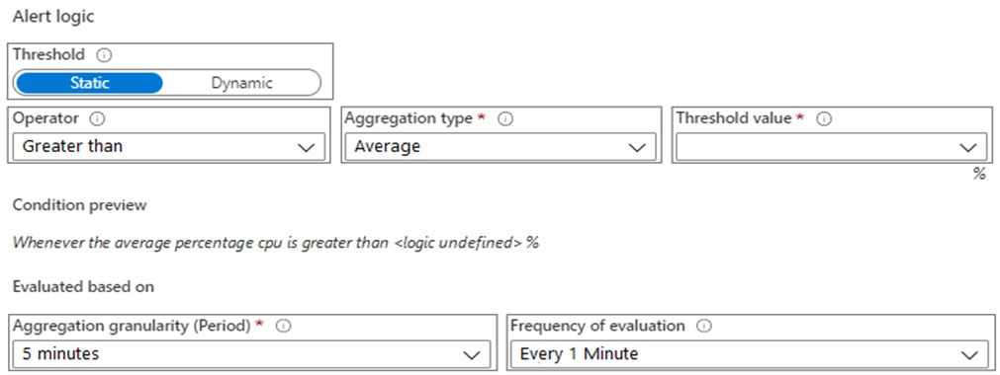
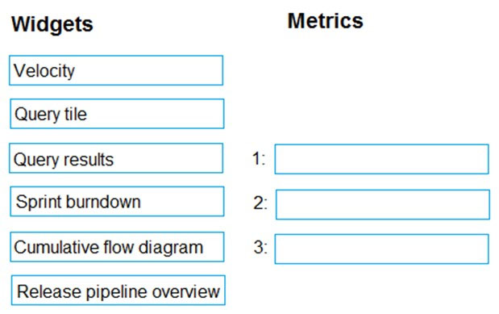
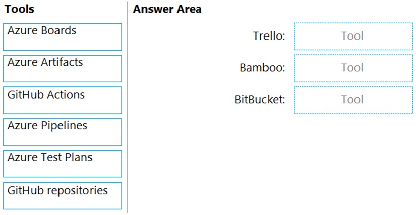

### General Overview -

Woodgrove Bank is a financial services company that has a main office in the United Kingdom.

### Planned Changes

Woodgrove Bank plans to implement the following project management changes:

-   Implement Azure DevOps for project tracking.
-   Centralize source code control in private GitHub repositories.
-   Implement Azure Pipelines for build pipelines and release pipelines.

Woodgrove Bank plans to implement the following changes to the identity environment:

-   Deploy an Azure AD tenant named woodgroveBank.com.
-   Sync the Active Directory domain to Azure AD.
-   Configure App1 to use a service principal.
-   Integrate GitHub with Azure AD.

Woodgrove Bank plans to implement the following changes to the core apps:

-   Migrate App1 to ASP.NET Core.
-   Integrate Azure Pipelines and the third-party build tool used to develop App2.

Woodgrove Bank plans to implement the following changes to the DevOps environment:

-   Deploy App1 to Azure App Service.
-   Implement source control for the DB1 schema.
-   Migrate all the source code from TFS1 to GitHub.
-   Deploy App2 to an Azure virtual machine named VM1.
-   Merge the POC branch into the GitHub default branch.
-   Implement an Azure DevOps dashboard for stakeholders to monitor development progress.

### Technical Requirements

Woodgrove Bank identifies the following technical requirements:

-   The initial databases for new environments must contain both schema and reference data.

-   An Azure Monitor alert for VM1 must be configured to meet the following requirements:

    -   Be triggered when average CPU usage exceeds 80 percent for 15 minutes.
    -   Calculate CPU usage averages once every minute.
    -   The commit history of the POC branch must replace the history of the default branch

-   The Azure DevOps dashboard must display the metrics shown in the following table.
    

-   Access to Azure DevOps must be restricted to specific IP addresses.
-   Page load times for App1 must be captured and monitored.
-   Administrative effort must be minimized.

---

## Question 1

You need to configure the alert for VM1. The solution must meet the technical requirements.

Which two settings should you configure?

    
answer

    Threshold value : 80% 
    Aggregation granularity(Period) : 15 minutes 

---

## Question 2

You need to meet the technical requirements for controlling access to Azure DevOps.

What should you use?

-   [ ] A. Azure Multi-Factor Authentication (MFA)
-   [ ] B. on-premises firewall rules
-   [ ] C. conditional access policies in Azure AD
-   [ ] D. Azure role-based access control (Azure RBAC)

    
answer

    C. conditional access policies in Azure AD 

---

## Question 3

You need to configure Azure Pipelines to control App2 builds.

Which authentication method should you use?

-   [ ] A. Windows NTLM
-   [ ] B. certificate
-   [ ] C. SAML
-   [ ] D. personal access token (PAT)

    
answer

    D. personal access token (PAT) 

---

## Question 4

You need to configure authentication for App1. The solution must support the planned changes.

Which three actions should you perform in sequence? 

-   [ ] A. Create an app
-   [ ] B. Add a secret
-   [ ] C. Create a credential
-   [ ] D. Configure the ID and secret for App 1
-   [ ] E. Create a managed service identity

    
answer

    A. Create an app 
    B. Add a secret 
    D. Configure the ID and secret for App 1 

---

## Question 2

You are configuring the Azure DevOps dashboard. The solution must meet the technical requirements.

Which widget should you use for each metric?

    
answer

    1 : Velocity 
    2 : Release pipeline overview 
    3 : Query tile 
    <a href="https://learn.microsoft.com/en-us/azure/devops/report/dashboards/widget-catalog?view=azure-devops#query-tile-widget">query-tile</a>

---

## Question 3

You plan to deploy a new database environment. The solution must meet the technical requirements.

You need to prepare the database for the deployment.

How should you format the export?

-   [ ] A. NDF
-   [ ] B. BACPAC
-   [ ] C. DACPAC
-   [ ] D. MDF

    
answer

    B. BACPAC 
    <a href="https://learn.microsoft.com/en-us/azure/azure-sql/database/database-export?view=azuresql">Export to a BACPAC file</a>

---

## Question 4

You need to meet the technical requirements for monitoring App1.

What should you use?

-   [ ] A. Splunk
-   [ ] B. Azure Application Insights
-   [ ] C. Azure Advisor
-   [ ] D. App Service logs

    
answer

    B. Azure Application Insights 

---

## Question 7

You need to replace the existing DevOps tools to support the planned changes.

What should you use?

    
answer

    Trello : Azure Boards 
    Bamboo : Azure Pipelines 
    BitBucket : GitHub repositories 

---

## Question 8

You need to the merge the POC branch into the default branch. The solution must meet the technical requirements.

Which command should you run?

- [ ] A. git rebase
- [ ] B. git merge --squash
- [ ] C. git push
- [ ] D. git merge --allow-unrelated-histories

    
answer

    A. git rebase 

---

## Question 9

You need to perform the GitHub code migration. The solution must support the planned changes for the DevOps environment.

What should you use?

- [ ] A. git clone
- [ ] B. GitHub Importer
- [ ] C. Import repository in Azure Repos
- [ ] D. git-tfs

    
answer

    D. git-tfs 
    <a href="https://learn.microsoft.com/en-us/devops/develop/git/migrate-from-tfvc-to-git">Migrate from TFVC to Git</a>

---
